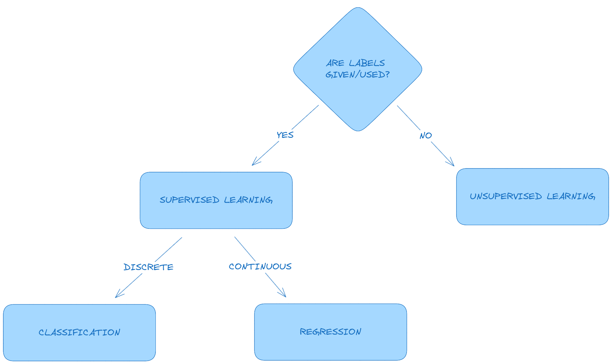
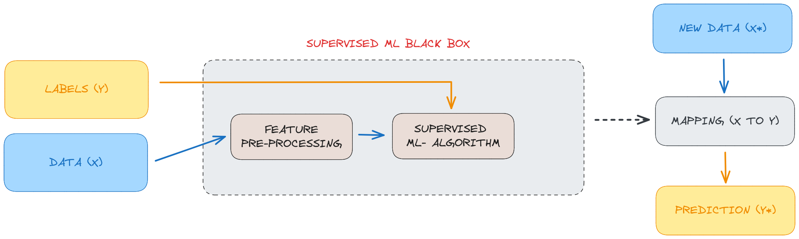

# Overview

The course is split up into two sections.  
The first is Machine Learning, and this will be lectured by Dr. Jamie Ward. He aims to cover the broader scope of machine learning, which will be theoretical in it's approach, though python code will be implemented along the way. Rather than just focus on neural networks, he'll cover linear regressions, decision trees etc. to give a more holistic account of the field.  
The second is Neural Networks, and this will be lectured by Dr. Tim Blackwell. This will be more hands on with implementations of neural networks from the get go.

# Topics

1. Introduction to Machine Learning and Neural Networks

> Key concepts:
> - applications of machine learning (and deep
> learning)
> - supervised and unsupervised learning
> - classification and regression  

> Learning outcomes:  
> - Explain fundamental machine learning
> concepts  
> - Describe various types of machine learning
> problem  
> - Describe various applications of machine
> learning  

2. Classification

> Key concepts:
> - K-nearest neighbour
> - Confusion matrices
> - Classifier evaluation  

> Learning outcomes:
> - Explain how a simple nearest neighbour
> algorithm works
> - Evaluate a supervised classification algorithm
> on a dataset
> - Describe the Decision Tree Classifier

3. Regression

> Key concepts:
> - linear models
> - gradient descent
> - data scaling

> Learning outcomes:
> - Explain the concept of linear regression and
> interpret results
> - Apply linear regression on a dataset
> - Explain the idea behind gradient descent

4. Model Improvement

> Key concepts:
> - bias-variance (overfitting, underfitting)
> - cross-validation
> - regularisation

> Learning outcomes:
> - Explain the effect of overfitting
> - Explain the concept of cross-validation
> - Explain how regularisation works

5. Probabilistic Classifiers

> Key concepts:
> - probabilistic modelling
> - bayes’ rules
> - naïve bayes classification
> - generative vs. discriminative modeling

> Learning outcomes:
> - Explain Bayes’ rule
> - Describe the Naive Bayes classifier
> - Discuss the difference between generative and discriminative models

6. Unsupervised Learning

> Key concepts:
> - k-means clustering
> - dimensionality reduction
> - linear projections

> Learning outcomes:
> - Explain the concepts of clustering and dimensionality reduction
> - Implement the k-means algorithm
> - Explain principal component analysis (PCA) and its properties.

7. Introduction to Machine Learning and Neural Networks - part 2

> Key concepts:
> - deep learning contexts
> - mathematical fundamentals
> - deep learning application
> - deep learning methodology

> Learning outcomes:
> - Describe multi-layer neural networks, backpropagation and deep networks
> - Explain machine learning workflow
> - Talk about the history and assess the future of deep learning

8. The mathematical building blocks of neural networks

> Key concepts:
> - the key mathematical concepts: tensors, transformations and stochastic gradient descent
> - sequence of data transformations
> - gradient descent optimisation

> Learning outcomes:
> - Understand the MNIST dataset
> - Understand how a simple neural network is built and trained with Tensorflow
> - Discover how data is packed into tensors and the fundamental of data representation of neural networks
> - Explain how a computer recognises hand written digits - our first neural network.

9. Getting started with neural networks

> Key concepts:
> - deep learning programs
> - training and validation plots
> - model evaluation
> - classification of movie reviews
> - multi-class classification

> Learning outcomes:
> - Understand the anatomy of a neural network
> - Apply neural networks to binary classification tasks
> - Apply neural networks to multi-class classification tasks
> - Apply neural networks to regression tasks

10. Fundamentals of machine learning

> Key concepts:
> - data preprocessing,
> - spotting and dealing with under- and overfitting
> - the universal machine learning workflow.

> Learning outcomes:
> - Know how and when to preprocess data
> - Know when a neural network is under-fitting or overfitting
> - Know how to address overfitting with network capacity reduction, weight regularisation and dropout

# Assessments
- Midterm coursework (50%)
- Final coursework (50%)

### Introduction to Machine Learning and Neural Networks

#### Applications and types of machine learning

Machine learning is a branch of artificial intelligence that in essence enables machines to learn by example. It is related to fields such as computer vision, signal processing, and data mining.  
Due to the increased availability of data, along with the increased amount of computational power available, we're seeing an increase in the use of machine learning algorithms and products that are part of our everyday lives, mobile phones, personal assistants, and so on.

Applications of machine learning include:
- face tracking and recognition
- body tracking (posture etc.)
- handwriting recognition
- speech recognition
- driverless cars
- recommender systems (ads, search etc.)
- generative machine learning
- sensor-based activity recognition

There are two main types of machine learning:
- supervised learning
- unsupervised learning

supervised learning operates on labelled data, whereas unsupervised does not

Imagine you were to be given a large amount of images of goats and xylophones.  
With supervised learning, the images would be labelled either goat or xylophone, and the supervised learning algorithm would be trained on the data to be able to accurately predict if a given image is either of a goat or a xylophone.  
With unsupervised learning the images would be clustered with respect to the contents of the images, with goat images clustering together and xylophones clustering together.  

An easy way to break down a typecal ML problem the following:

There is a third type of machine learning: _Reinforcement learning_

With reinforcement learning, the interest is predicting a sequence of actions that entail a specific reward

##### The machine learning 'black box'

See below a typical machine learning pipeline:

This essentially represents a training stage in a supervised learning algorithm.  
We want to approximate some mapping between x and y. That is, map the inputs to the outputs. An example of this process might be: given a set of images containing faces which we call x, and a set of output labels y which would be the identity of each of the people in the images, we can then learn a mapping that links the facial images to their identities.  
When a new data sample arrives, data that we haven't seen before indicated by x*, we can use this mapping that we've learned on x and y, the experience in the system, to provide a prediction which we call y*.  

If we have a look inside the black box, we find that even in supervised learning systems, most of the time, unsupervised learning methods are also used. In many cases as a pre-processing stage.  
This is useful as it usually reduces the number of variables that we have to analyze, making the task of learning a mapping from input to output less challenging.