import Latex from '../../components/Latex.astro'

# Overview

The course is split up into two sections.  
The first is Machine Learning, and this will be lectured by Dr. Jamie Ward. He aims to cover the broader scope of machine learning, which will be theoretical in it's approach, though python code will be implemented along the way. Rather than just focus on neural networks, he'll cover linear regressions, decision trees etc. to give a more holistic account of the field.  
The second is Neural Networks, and this will be lectured by Dr. Tim Blackwell. This will be more hands on with implementations of neural networks from the get go.

# Topics

1. Introduction to Machine Learning and Neural Networks

> Key concepts:
> - applications of machine learning (and deep
> learning)
> - supervised and unsupervised learning
> - classification and regression  

> Learning outcomes:  
> - Explain fundamental machine learning
> concepts  
> - Describe various types of machine learning
> problem  
> - Describe various applications of machine
> learning  

2. Classification

> Key concepts:
> - K-nearest neighbour
> - Confusion matrices
> - Classifier evaluation  

> Learning outcomes:
> - Explain how a simple nearest neighbour
> algorithm works
> - Evaluate a supervised classification algorithm
> on a dataset
> - Describe the Decision Tree Classifier

3. Regression

> Key concepts:
> - linear models
> - gradient descent
> - data scaling

> Learning outcomes:
> - Explain the concept of linear regression and
> interpret results
> - Apply linear regression on a dataset
> - Explain the idea behind gradient descent

4. Model Improvement

> Key concepts:
> - bias-variance (overfitting, underfitting)
> - cross-validation
> - regularisation

> Learning outcomes:
> - Explain the effect of overfitting
> - Explain the concept of cross-validation
> - Explain how regularisation works

5. Probabilistic Classifiers

> Key concepts:
> - probabilistic modelling
> - bayes’ rules
> - naïve bayes classification
> - generative vs. discriminative modeling

> Learning outcomes:
> - Explain Bayes’ rule
> - Describe the Naive Bayes classifier
> - Discuss the difference between generative and discriminative models

6. Unsupervised Learning

> Key concepts:
> - k-means clustering
> - dimensionality reduction
> - linear projections

> Learning outcomes:
> - Explain the concepts of clustering and dimensionality reduction
> - Implement the k-means algorithm
> - Explain principal component analysis (PCA) and its properties.

7. Introduction to Machine Learning and Neural Networks - part 2

> Key concepts:
> - deep learning contexts
> - mathematical fundamentals
> - deep learning application
> - deep learning methodology

> Learning outcomes:
> - Describe multi-layer neural networks, backpropagation and deep networks
> - Explain machine learning workflow
> - Talk about the history and assess the future of deep learning

8. The mathematical building blocks of neural networks

> Key concepts:
> - the key mathematical concepts: tensors, transformations and stochastic gradient descent
> - sequence of data transformations
> - gradient descent optimisation

> Learning outcomes:
> - Understand the MNIST dataset
> - Understand how a simple neural network is built and trained with Tensorflow
> - Discover how data is packed into tensors and the fundamental of data representation of neural networks
> - Explain how a computer recognises hand written digits - our first neural network.

9. Getting started with neural networks

> Key concepts:
> - deep learning programs
> - training and validation plots
> - model evaluation
> - classification of movie reviews
> - multi-class classification

> Learning outcomes:
> - Understand the anatomy of a neural network
> - Apply neural networks to binary classification tasks
> - Apply neural networks to multi-class classification tasks
> - Apply neural networks to regression tasks

10. Fundamentals of machine learning

> Key concepts:
> - data preprocessing,
> - spotting and dealing with under- and overfitting
> - the universal machine learning workflow.

> Learning outcomes:
> - Know how and when to preprocess data
> - Know when a neural network is under-fitting or overfitting
> - Know how to address overfitting with network capacity reduction, weight regularisation and dropout

# Assessments
- Midterm coursework (50%)
- Final coursework (50%)

### Introduction to Machine Learning and Neural Networks

#### Applications and types of machine learning

Machine learning is a branch of artificial intelligence that in essence enables machines to learn by example. It is related to fields such as computer vision, signal processing, and data mining.  
Due to the increased availability of data, along with the increased amount of computational power available, we're seeing an increase in the use of machine learning algorithms and products that are part of our everyday lives, mobile phones, personal assistants, and so on.

Applications of machine learning include:
- face tracking and recognition
- body tracking (posture etc.)
- handwriting recognition
- speech recognition
- driverless cars
- recommender systems (ads, search etc.)
- generative machine learning
- sensor-based activity recognition

There are two main types of machine learning:
- supervised learning
- unsupervised learning

supervised learning operates on labelled data, whereas unsupervised does not

Imagine you were to be given a large amount of images of goats and xylophones.  
With supervised learning, the images would be labelled either goat or xylophone, and the supervised learning algorithm would be trained on the data to be able to accurately predict if a given image is either of a goat or a xylophone.  
With unsupervised learning the images would be clustered with respect to the contents of the images, with goat images clustering together and xylophones clustering together.  

An easy way to break down a typical ML problem is the following:

There is a third type of machine learning: _Reinforcement learning_

With reinforcement learning, the interest is predicting a sequence of actions that entail a specific reward

##### The machine learning 'black box'

See below a typical machine learning pipeline:

This essentially represents a training stage in a supervised learning algorithm.  
We want to approximate some mapping between x and y. That is, map the inputs to the outputs. An example of this process might be: given a set of images containing faces which we call x, and a set of output labels y which would be the identity of each of the people in the images, we can then learn a mapping that links the facial images to their identities.  
When a new data sample arrives, data that we haven't seen before indicated by x*, we can use this mapping that we've learned on x and y, the experience in the system, to provide a prediction which we call y*.  

If we have a look inside the black box, we find that even in supervised learning systems, most of the time, unsupervised learning methods are also used. In many cases as a pre-processing stage.  
This is useful as it usually reduces the number of variables that we have to analyze, making the task of learning a mapping from input to output less challenging.

### Week 3: Classification - part 1

#### K-Nearest Neighbours

One of the simplest and surprisingly effective algorithms for classification is K-nearest neighbors. This works along the basic premise that things are similar if they're closer together. Take an example where we have some images that we want to classify. We have a test image, which is a picture of a goat, and we want to find out what it is. In our training data set, we've got images of goats, and we've got images of xylophones.  
How do we detect what our test dataset is? Well, we could imagine comparing that test image to all the other images in the training dataset, and finding the one that matches it that is closest to it. And this is the basic premise behind K-nearest neighbors.

For example, if we were to look at a 2D problem, these images could be in a two-dimensional space. The X1 axis could be the noise that's made from these things. The X2 axis could be referring to an other feature, e.g. color etc.  

Now, if we want to find the distance between each of these things, we could use something like _Euclidean distance_, where the distance from <Latex formula='(x_1,y_1)' /> to <Latex formula='(x_2,y_2)' /> is:

<Latex formula='\sqrt{(x_2-x_1)^2+(y_2-y_1)^2}' centered={true} />

That allows us to very simply calculate the difference between two points in this case two-dimensional space.  
An alternative measure would be to calculate the _Manhattan_ distance. And that would be the direct up, and down, summed up: 

<Latex formula='|x_2-x_1|+|y_2-y_1|' centered={true} />

In this case, we're looking at Euclidean distance.  
We calculate the distance from our test image to each of the images on our training set. Then we find the one that is the closest, the shortest distance. And we can assign the label of the training data example, the one here that's marked with a red line, we can take that label and assign it to a test dataset. And that would allow us to classify our test data.

This simple example is K-nearest neighbor with K = 1. That is, it's the first nearest neighbor and the single test training image that is closest. But we could have K = 2, and that would be where we look at the two closest images, and if they've got the same label, then that's the label of our test image. And if they have different labels, then we have a confusion problem.  
K-nearest neighbors is a relatively simple algorithm with two main parameters. The first is K, which is the number of nearest neighbors that we're going to look for. And the second one is the similarity or the distance measure, which allows us to compare the different data points. And in this case we used Euclidean distance.

K-nearest neighbor is known as a _lazy learning algorithm_. That is, we don't generalize on the training dataset until we actually want to make a query.

#### Decision Trees

Decision trees are among the most versatile class of machine learning algorithm. They are capable of handling both classification and regression tasks and they're able to deal with complex, non-linear datasets. They're particularly useful as the basic classifier in random forests, which are among the most powerful class of machine learning algorithm. For this example, where we want to distinguish between two types of animal, rabbits or hares. Our data has at least two features, whether the animal can be found in a burrow or not, and its ear length.  

At the top of the tree, we have the root node, which asks a binary question of the __most distinguishing feature__ between the two classes (the feature that contains the most information). In this case, we know that hares almost never burrow under the ground, whereas all rabbits do. If the animal does not borrow, it is most certainly a hare. If the animal can be found in a burrow, we move on to how we can further separately using the second-most information feature, in this case ear length. This time we use a condition on this feature with values above a certain threshold designated as one class and equal to or below that threshold to the other class. The bottom-most nodes, where we make our final class designations, whether it's a rabbit or hare, are known as _leaf nodes_.

Decision trees are known as "White Box" models. This means that decision trees are easy to interpret. This is because they're based on a hierarchy of simple classification rules which are easily visualized. This is in opposition to black box models, like deep neural networks. In black-box models, decisions are made in a process which is far more opaque.  
With decision trees, we can easily traverse the tree by eye and see the criteria for how the decisions are made. If we were to plot some sample data on the feature space of this rabbit versus hare example, we might get something like the below:

If we map the decision tree onto the space, we create what's known as a decision boundary. For example, the root decision divides the data into two areas, whether the animal burrows or it does not. Any new sample that falls into the no side, so lower down on the y-axis, the burrows feature, that would be classified as a hare.

The second level decision on ear length only then applies to data that has had a yes to burrowing. 

Continuing in this vein, adding decision criteria and making the tree much deeper, can lead to very complex and non-linear decision boundaries. They can capture almost any shape.

There are different types of decision tree algorithm, but they broadly work along a similar principle. One common type is __Classification and Regression Decision Tree (CART)__. This is a binary tree that as its name suggests, can be used for both classification and regression. Imagine we have a dataset containing samples of two classes, crosses and circles. The goal is to fit a decision boundary that can best separate these two groups.

  

The algorithm works as follows. Starting with a root node, find the combination of a single feature, in this case either x or y, and a threshold value that best splits the entire dataset in two. This data reveals feature x with a threshold of three. The choice of where to split the data is based on _minimizing the impurity_ of each of the two decision regions. That is aiming to have the most crosses in one region and most circles in the other.

If a region is impure, that is it contains a mixture of classes, we grow the tree on to a second level split. This node then acts as a new route on a subset of the dataset for all examples where x is greater than three. By splitting the y-axis at two, that subset uncovers a new region which contains only circles. The impurity is zero for this, so we can actually define a leaf node and stop recursing down that branch. 

The remaining subgroup of data still contains a mixture of circles and crosses, so we continue to recurse. A further split in the y feature helps us to create a new leaf, and so on. The final split on this side of the tree reaches two leaves, which perfectly partitions all the data for x is greater than 3.

The algorithm can then return to the original root node, and the same procedure traverses down the left side of the tree for x is less than or equal to three, until we reach the final tree that perfectly divides the dataset. 

Growing a tree and creating an ever more complex decision boundary is a major advantage of decision trees, in that it can be used to capture complex relationships in the data. However, the danger of a decision tree is that they're prone to overfitting. This is where they fit training data perfectly, but perhaps too well, so much that they might not be able to generalize to new data that hasn't been seen before. This follows from the principle of Occam's Razor, where often a simpler solution is preferable.

A simple solution to solve this is to force the algorithm to be simpler, to _regularize_ it. One way to do this is to restrict the depth of a tree, forcing leaf nodes to be formed despite the fact that there may be misclassifications. Alternatively, we could grow the tree fully and then prune it afterwards to find the best compromise solution. This is often the preferred approach. 

Finding the optimal split and feature combination is an np-complete problem. It's computationally intractable even for small datasets. The __CART__ algorithm described here uses _greedy training_. That is, it computes only the optimal split at each node and sequence, but doesn't consider the optimization of the tree as a whole. It often provides a good overall solution despite not being optimal.  
A further advantage of decision trees over many other algorithms, including K-nearest neighbor, is that the algorithm can work on raw feature data without the need for data pre-processing. There's no need to scale or to center the data before-hand.  
Decision trees are incredibly powerful algorithms and very flexible, and although we've covered them using classification, they can also be used for regression tasks. They're are also used as the base algorithm in one of the most powerful types of machine learning: Random Forests.

### Week 4: Classification - part 2

How can the performance of a classifier be measured?  
One way is to measure the accuracy. That is, the percentage of correctly classified examples from the total number of samples. This however is not always a good measure of the quality of a classifier.  
For example, if there are 99 samples from Class 1 and only one sample from Class 2, then, the classifier algorithm can simply output class one for _every instance_. It would achieve a 99% accuracy score, but it's completely missing all from Class 2. So we therefore need a more nuanced way of evaluating our classification algorithms. One such way is to use a confusion matrix.

#### Confusion Matrix

A confusion matrix is a matrix where each cell contains a number that represents a population of labels that belong to a specific combination of predicted and actual classes.  
Given the results of a classifier, we can formulate the confusion matrix by simply filling in the cells corresponding to predictions and actual ground truth labels.  
Consider the following example of a binary classifier:

There are two possible outputs, <Latex formula="(Y \rarr \{0,1\})" />, tested on <Latex formula="N=10" /> data samples

The correct 'ground truth' labels are:

<Latex formula="Y^{GT}=[1,0,0,1,0,0,1,1,1,1]" centered={true} />

The classifier predicted output was:

<Latex formula="Y^P=[1,1,1,1,1,0,1,1,1,1]" centered={true} />

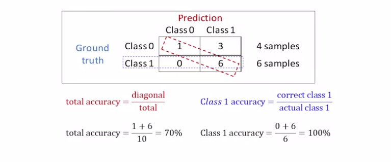

Let's look at a more formal aspect of the confusion matrix. Firstly, in a binary classification problem, we can consider each cell as corresponding to a positive and negative class. In the below example, a positive class represents the detection of a dog in an image. And the negative class represents that an image does not contain a dog.
- True positives are test samples that have been correctly identified as a dog
- True negatives have been correctly identified as not a dog
- False positives represent samples that were incorrectly identified as a dog
- False negative samples for those that were incorrectly identified as not being a dog

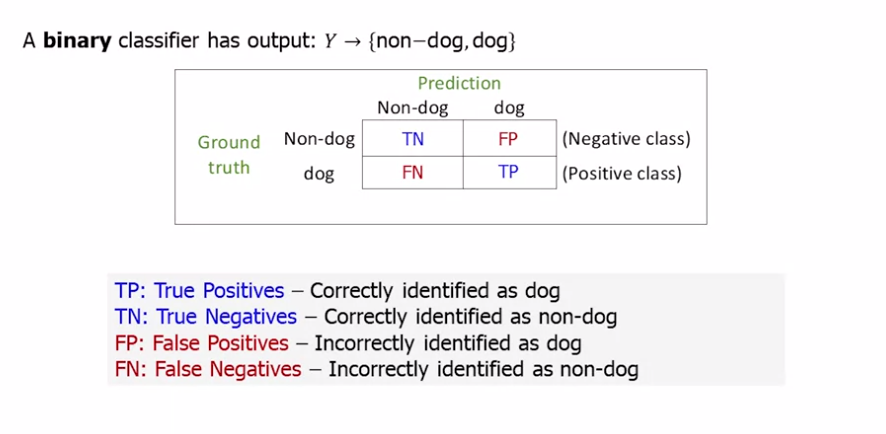

Often it's better to use multiple measures of performance as opposed to just accuracy. Two typical measures that are often used together are <mark>recall</mark> and <mark>precision</mark>.

Given an actual positive example, __recall__ expresses how likely it is that a classifier will predict the _correct_ value i.e. likely is it that a positive example will be correctly recalled. The formula for this is shown below in terms of true positives over true positives plus false negative.

Now, given a positive prediction by the classifier, __precision__ estimates how likely it is the _prediction will be correct_ i.e. how precise the positive predictions are. Again, the formula for this using true positives and false positives is shown below.

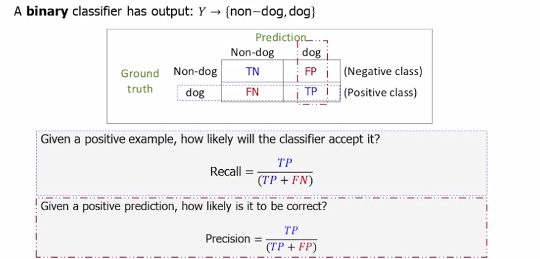

Know that for some applications, it may be beneficial to optimize the performance with respect to false positives.  
For example, in security applications that use face recognition, it may be safer to fail to identify someone who should have access i.e. get a false negative, than get a false positive and wrongly allow access to a prohibited person.

This week there was a lab on knn and decision trees, recap via coursera

### Week 5: Regression

#### Introduction to linear regression

This topic covers an extremely powerful supervised learning technique called linear regression. As mentioned in previous topics, regression is where we build models that aim to predict continuous values from data.  
Linear regression is a simple technique for fitting that data using linear equations. Given a set of data, you can imagine drawing a line in a possibly high-dimensional space that best represents the data labels with respect to its inputs. To optimize a linear regression model on some data, we introduce a first order optimization method called gradient descent.  
This is a commonly employed iterative technique for finding the best linear model parameters to fit a given data set. We'll discuss other topics such as how to scale features before applying multivariate linear regression, and how to detect convergence automatically in iterative algorithms.

Take the below example:

  

    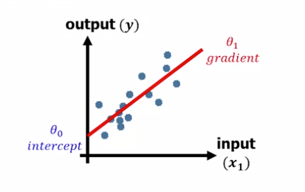
  

The linear regression (red line) is defined by two parameters, <Latex formula="\theta_0" /> and <Latex formula="\theta_1" />.

<Latex formula="\theta_0" /> is the __intercept__ and <Latex formula="\theta_1" /> is the __gradient__.

it can be expressed mathematically as hypothesis function: 

<Latex formula="h_{\theta}(x) = \theta_0 + \theta_1 x_1" centered={true} />

it can also be expressed as a summation: 

<Latex formula="= \displaystyle \sum_{j=0}^{1} \theta_j x_j" centered ={true} />

with <Latex formula="x_0 = 1" />. This is handy as it is more generalised (see later). 

It can also be expressed in vector form:

<Latex formula="= [ 1 \space x ] \begin{bmatrix} \theta_0 \\ \theta_1 \end{bmatrix}" centered ={true} />

Lets look at a concrete example. Take a look at the following data:

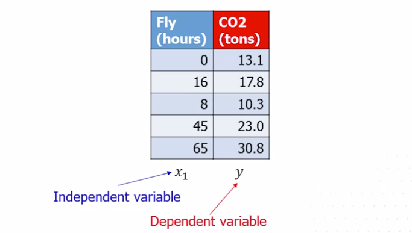

Whenever you've got a dataset of values like this in machine learning, it's helpful to plot it. If you can plot it, you can see visually if there's any relationships between the variables we're interested in.

  

    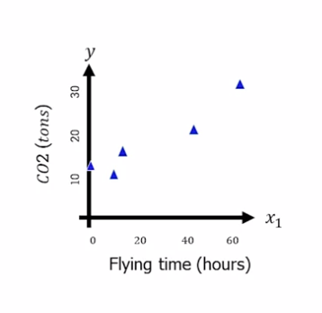
  

It can be seen that there is with each of these data points, a linear relationship. So that gives us hope that we could maybe model this relationship with a line with a linear equation. So lets set out our hypothesis, <Latex formula="h_{\theta}(x) = \theta_0 + \theta_1 x_1" />, and the goal now is to find the line that best fits that data.  
One approach to try this is to start with a random line, and measure the distance between that line and the data:

  

    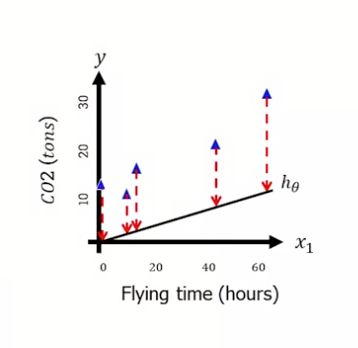
  

What we're trying to measure here is the __error__ or the __loss__. There are different ways of expressing this particular loss, but in this instance we're using "L2 loss", sometimes called the "least squared loss" or the "mean squared error":

<Latex formula="J(\theta) = \frac{1}{2m} \displaystyle \sum_{i=1}^{m} (h_\theta (x^{(i)})-y^{(i)})^2" centered ={true} />

The goal is to move that line closer to the data. The error, or loss should be smaller. Move it again and the losses even smaller. And then we find something that seems to fit the data nicely, and that should have the __least error__, the __least amount of loss__.  
This loss function is a very powerful way of being able to measure the distance between what our algorithm or hypothesis is saying, and what the actual data is.  
N.B. The algorithm for "moving the line" will be covered soon.

  

    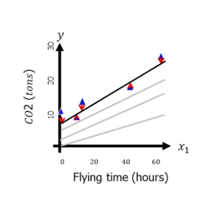
  

#### Linear regression jupyter notebook

<iframe
  src="/assets/cm3015/lin-reg.html"
  width="100%"
  style={{height: '70vh'}}
></iframe>

#### further reading

These links will be helpful:
- [linear algebra cheatsheet](https://ml-cheatsheet.readthedocs.io/en/latest/linear_algebra.html)
- [Deep Learning book linear algebra section](https://www.deeplearningbook.org/contents/linear_algebra.html)

### Week 6: Gradient Descent

#### Gradient descent in 1D

In the contrived example below, the loss function, <Latex formula="J(\theta)" />, is calculated for four different gradients and the outputs vs gradients are plotted on the RHS. In this case, the plot has a convex curve, and the point at which the loss function is zero, the gradient of the loss plot is also zero. 

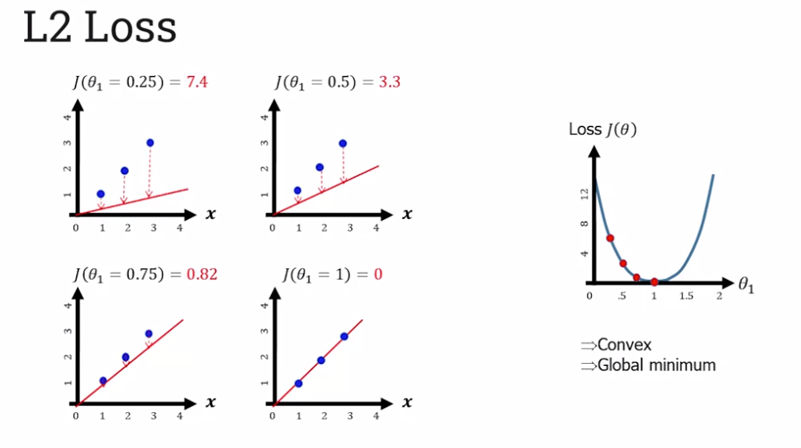

The benefit of the plot being convex is that an iterative technique called gradient descent can be used to automatically fit a line to the data.  
The goal of gradient descent is to find the optimal parameter values that helps us to minimize our loss.

So choosing a random point on the loss function curve, we calculate the gradient at that point. In the example below the initial gradient is a strongly positive gradient, so to get to the bottom of the curve (optimal parameter values) we must move left (where the gradient is lower).

  

    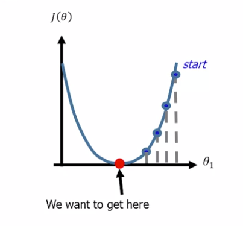
  

The basic premise of gradient descent is that we need to be able to calculate the gradient at any point on the loss curve, and we want to move away from the steepest ascent or away from the steepest descent, and to do that, we need to be able to differentiate the loss function. So starting with the L2 loss function (with the line equation exploded):

<Latex formula="J(\theta) = \frac{1}{2m} \displaystyle \sum_{i=1}^{m} (\theta_0+\theta_1 x_1^{(i)}-y^{(i)})^2" centered ={true} />

We can differentiate (using partial derivatives, due to having two parameters, <Latex formula="\theta_0" /> and <Latex formula="\theta_1" />, but in this case we're only focusing on <Latex formula="\theta_1" />, 1D remember...) to get:

<Latex formula="J_1'(\theta) = \frac{\delta J(\theta)}{\delta \theta_1} = \frac{1}{m} \displaystyle \sum_{i=1}^{m} (\theta_0+\theta_1 x_1^{(i)}-y^{(i)}) \cdot x_1^{(i)}" centered ={true} />

So how does gradient descent work and how does it use the derivative function?  
In the case of the example above, we want to slide down the slope. We want to move away from the steepest ascent, and to do that, we simply take a parameter value that we have, our current parameter value, and we subtract from it an _Alpha value_ multiplied the _derivative that we've calculated from that point_. The Alpha value is known as the __convergence rate__, and it changes the speed at which your gradient descent algorithm will happen.

<Latex formula="\theta_1^{(2)} = \theta_1^{(1)} - \alpha J_1'(\theta^{(1)})" centered ={true} />

  

    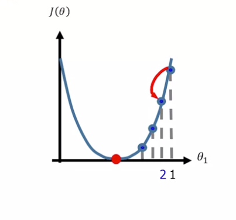
  

The key idea here is that if we are in a very steep part of the slope and it's ascending, so it's large and positive, then we want to move far away from it. By subtracting a big number, we move far away from it. But as we get to the bottom, so as we roll down the hill here and we get closer and closer to our convergence point, the slope gets smaller and smaller. This term that we're subtracting gets smaller and smaller. The derivative gets smaller and smaller, and that means that we start to move and more incremental steps until finally we reach the convergence point.

In summary, the gradient descent algorithm works by first finding a point on the loss curve. You calculate the gradient at that point on the loss function, the derivative, and then you apply the gradient descent update rule, where you change your original parameter by an amount that's _dependent on the gradient that you calculated_. This continues down, until your algorithm converges and a minimum point is found.

Attention must be paid to the convergence rate (a.k.a learning rate). The value is small (usually between 0 and 1), but if it is too small, the gradient descent algorithm moves far too slow as the steps between gradient calculations are too small.  
If too large, the algorithm will never converge as it continuously jumps either side of of the minimum.

#### Gradient descent in 2D

So far, our gradient descent algorithm has only really dealt with one parameter. But we've conveniently ignored the fact that our linear regression equation has two parameters in it. See below the partial derivative with respect to <Latex formula="\theta_0" /> included as well:

  

    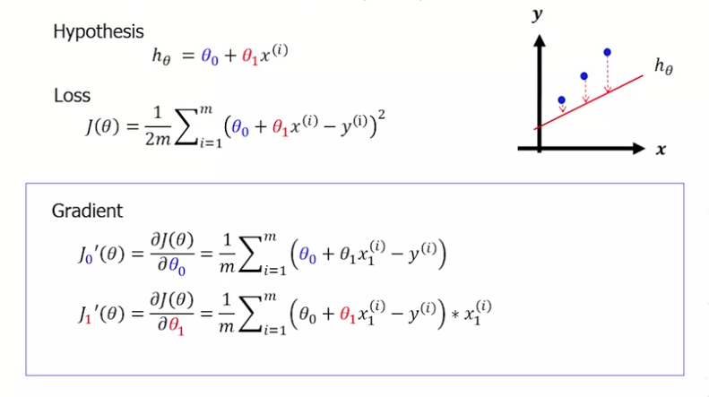
  

So gradient descent for this linear equation is actually a two dimensional problem, not one dimensional. This means we can start to think of the loss function of more of a bowl that a u-shape, where in one dimension we have <Latex formula="\theta_0" />, and in the other we have <Latex formula="\theta_1" /> and then the loss value as before, <Latex formula="J" />.  

  

    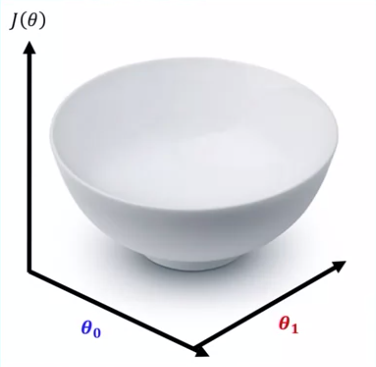
  

The gradient descent algorithm is scalable to increasing the number of dimensions. So we do the same procedure. We initialize at a random point. We select some random values for <Latex formula="\theta_0" /> and <Latex formula="\theta_1" />, we calculate the loss, and plot that on a 3D plot.  
We then iteratively use the update function. It's shown below in vector format, but what we're actually doing is an update on both of the parameters in parallel with one another. This continues until convergence is met.

  

    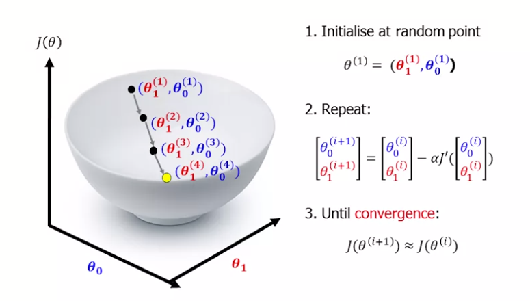
  

##### Batch gradient descent

The type of gradient descent described so far is called batch gradient descent. It's called that because on every single iteration, it uses all of the data. This means it can be quite slow if there is a lot of data.  
Below you can see a more general form of the update function:

while not converged:

  

    <Latex formula="\theta_j^{new} = \theta_j - \alpha \frac{1}{m} \displaystyle \sum_{i=1}^{m} (h_{\theta}(x^{(i)})-y^{(i)})x_j^{(i)}" /> 
  

  

    for <Latex formula="j = 0, 1,... n" />
  

The difference between this update equation and the previous ones we've shown is that the theta value can be any number. So it's a _multivariant_ case. J could be from 0 to n.

##### Stochastic gradient descent

Instead of summing up over all of the data points, we choose one of the data points at random and update based on that. The advantage of this being that it's faster.

while not converged:  
i = random(1,m)  
<Latex formula="\theta_j^{new} = \theta_j - \alpha (h_{\theta}(x^{(i)})-y^{(i)})x_j^{(i)}" />  for <Latex formula="j = 0, 1,... n" />

It's a lot faster, but the problem is that it doesn't necessarily converge smoothly. What can happen is the gradient moves in a zigzag-like fashion, this can lead to problems and is not always the best solution

##### Mini batch gradient descent

A hybrid solution between these two is to do a thing called Mini Batch gradient descent, where you don't use all of the data at each time point, but instead you take a random sub-selection of data, and use that to evaluate your update.

##### Multivariant

In a more general form, our multi variant linear model looks like below:

  

    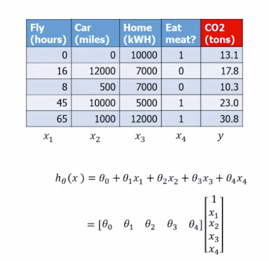
  

  

    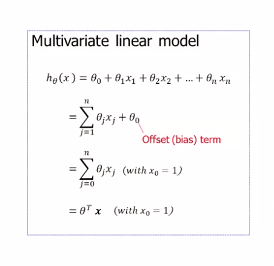
  

Our hypothesis function is a combination of the parameters and multiplied by the variables that we have.

One thing to bear in mind is that we've always got the <Latex formula="\theta_0" /> term (the offset or the bias term), and that's a constant, so that shouldn't be multiplied by any variable. We always have to bear that in mind, particularly if we're using Sigma notation. We always have remember <Latex formula="x_0 = 1" />

#### Data scaling

When you use multivariate data there can be issues, particularly with gradient descent, with the scaling of the values. In the above example, the number of hours flying is in the tens and maybe up to 100, whereas the number of kilowatt-hours used in the home can be 10,000 or more. The scaling of these values is vastly different. What this means is that when we try to learn a linear model, our <Latex formula="\theta" /> values can be quite off from one another.

A practical step often taken in machine learning is to scale the data beforehand. A common way of doing this is by _min-max normalization_, which forces all numbers between 0 and 1:

<Latex formula="x_j^s = \frac{x_j - min(x_j)}{max(x_j) - min(x_j)}" centered={true} />

The benefit of this is that the gradient descent algorithm will converge faster, as depicted in the image below:

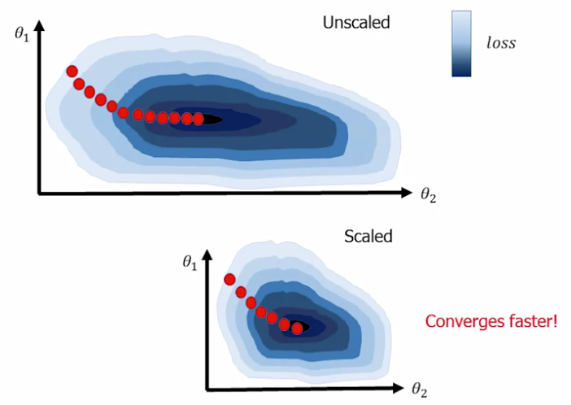

Min-max normalisation isn't the only way to normalise, there are other methods, e.g. _range normalisation (centred on mean)_ and _standardisation (z-score)_. Range normalisation centres the data along the mean:

<Latex formula="x_j^s = \frac{x_j - mean(x_j)}{max(x_j) - min(x_j)}" centered={true} />

For standardisation (z-score), all the data is centered on the mean, but rather than between zero and one, we're dividing by standard deviation of our data set:

<Latex formula="x_j^s = \frac{x_j - mean(x_j)}{std(x_j)}" centered={true} />

#### Polynomial regression

Data can complicated and sometimes a line doesn't always do it. In the example below LHS the line doesn't fit the data very well. It's almost too simple.

We can increase the number of features without adding any extra variables. So in the example above, C02 was dependent on the number of miles someone drove, or the amount of meat they ate, or the amount of electricity used etc. Rather than introducing new variables, we could stick with the same variable. So just using the number of miles someone drives, but then try and make it fit the data by squaring it or taking the square root of it.  
So we can create say a quadratic equation which may fit our data better. In the middle below we see if we add a quadratic term, <Latex formula="\theta_2x^2" />, it starts to fit it a bit better.  
And then if we take a 3rd order polynomial term (below RHS), we add another term <Latex formula="\theta_3x^3" /> and it fits the data even better. So this polynomial approximation is a simple way of actually trying to fit our data better.  
_It's still a linear equation i.e. the parameters are linear, but the data itself is non-linear._

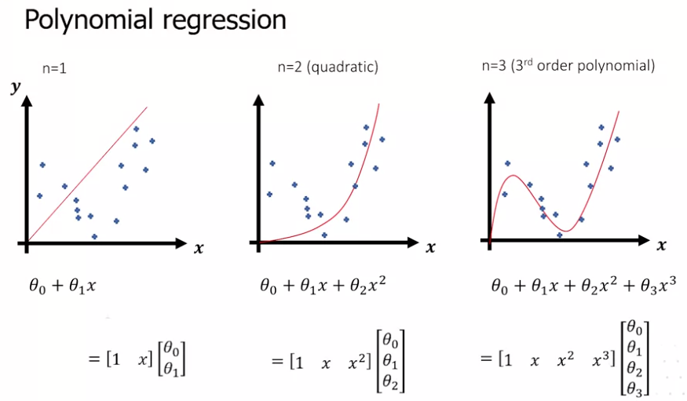

#### Gradient descent lab notebook

<iframe
  src="/assets/cm3015/gradient-descent.html"
  width="100%"
  style={{height: '70vh'}}
></iframe>

### Week 7: Model evaluation and improvement

#### Bias Variance (overfitting and underfitting)

Imagine you've tried fitting a line onto some data points. __Underfitting__ would be if the line was overly simple, inflexible, and did not fit the data very well. It could be described as having _'high bias'_.  
Overfitting would be the line fitting the data much better, but it has a high variance and is overly complex.

  

    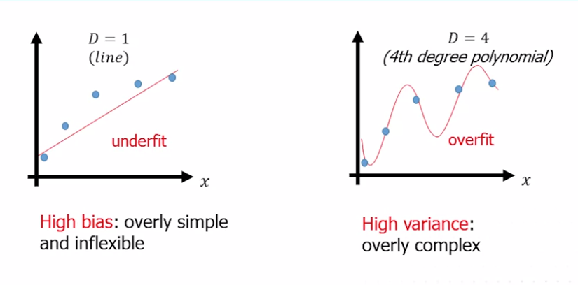
  

Ideally what you want is something in between, a simpler quadratic curve in this particular instance which fits the data just right:

  

    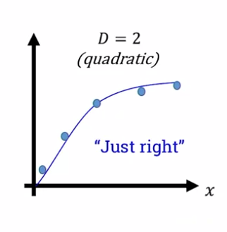
  

The idea of trying to tune your models so that they get this 'just right' situation is basically what we're trying to do. We're trying to make our model generalizable, so that fits the data very well, but it's generalizable to new data that we've not seen before.

##### Bias-variance curve

If we want to evaluate a machine learning solution to be generalizable to new data, to be a solution that just fits, we could use the bias-variance curve. The bias-variance curve allows us to plot along the x-axis some measure of model complexity. If we're using polynomial models, we could use the degree of polynomial, and on the y would be the amount of error. When we're training our data using a set of data and we're testing on the same data, we tend to see a curve like this:

  

    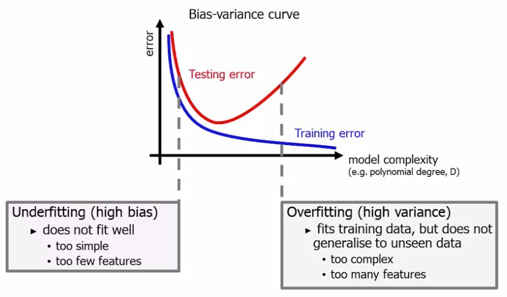
  

The error goes down as the model gets more complex. However, if we then test it on data that we haven't seen before that we've kept aside (our test set), we get a slightly different curve and this is our _testing error_. At the start the error goes down, It then reaches a sweet spot where it seems relatively low, but then it starts to rise again The error goes up as the model becomes more complex. The model is too simple or has too few features to really describe what's going on.  
At the other end, we have overfitting. This is where we have a high variance in the model. It fits the training data really well, but it does not generalize to the unseen data, the testing error goes up. Arguably, this is because the model is too complex, so it has too many features. Ideally, we want the sweet spot somewhere in the middle, which gives us a nice model which is generalizable to unseen data.

There are two basic approaches to ensure our model is more generalisable:

###### Reduce the number of features
- manually select which features to keep
- use a model selection algorithm e.g. cross-validation

###### Regularisation
- keep all the features, but reduce the values of parameters, <Latex formula='\theta_j' />
- works well when there's a lot of features

#### Regularisation

Regularisation is a method of penalizing complexity in our machine learning model. For the example above, see the two curves that fit the data. Both the 4th order polynomial and the quadratic function have a loss value of zero. How do we design our model selection algorithm to be able to favor the quadratic (loss complex) approach?

  

    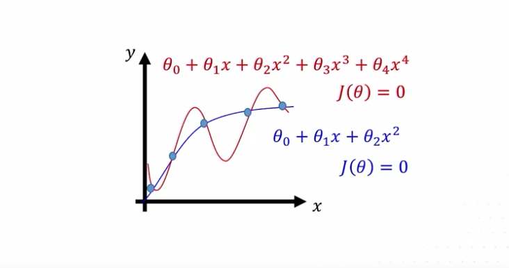
  

One thing we could do is have a look at the parameters involved. If we look at all the parameters in the first model (4th order polynomial), we can make a vector of all of those. If we were to square them all so they're positive and sum them up, we'd have a number, in this case it's 25. If we do the same for the simpler model there are fewer parameters, and if we sum up their parameters, we see the square of each of them summed up is only 1.2, it's _much less_. We can use these parameter combinations to help us decide.  
Regularization is where we add a penalty to the loss function based on this complexity measure. We can base it on <Latex formula='\theta^2' />, which is called __L2 regularization__. We're squaring the parameters to ensure that they're positive.  
Alternatively we could take the absolute value of the parameters, and that's known as __L1 regularization__. In this case we'll going focus on L2.

  

    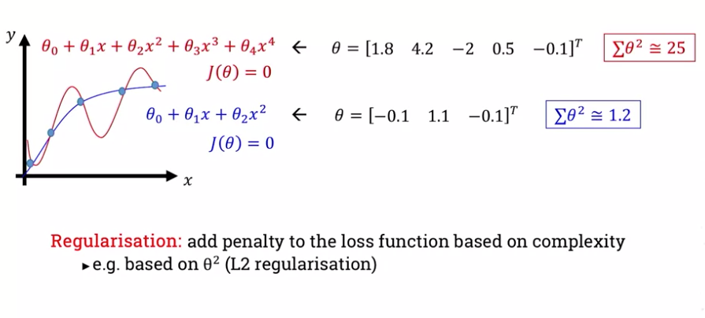
  

See below the loss function mentioned previously, but modified accordingly. This is the __regularised loss__:

<Latex formula="J(\theta) = \frac{1}{2m} \displaystyle \sum_{i=1}^{m} (h_\theta (x^{(i)})-y^{(i)})^2 + \lambda \sum_{j=1}^{n} \theta_j^2" centered ={true} />

An important hyperparameter in regularised loss is the lambda value, and this is known as the __regularisation hyperparameter__. If this hyperparameter lambda is too big, the algorithm underfits, the data values are forced to become very small and the model becomes very simple. Equally, if the lambda value is too small, then the algorithm may over-fit. That will force the theta value to become very large, and essentially the regularisation term isn't really having an effect.

Where regularization is very useful is when we apply it within the gradient descent algorithm. We've just calculated our new regularized loss function, but how do we fit that into our gradient descent update rule?

The gradient descent algorithm works the same as before. First, randomly initialise all our parameters, then within a loop we:
1. calculate the loss (now the regularised loss)
2. call the update functions
  - we update the bias term without regularisation
  - for all other parameters we'll update them using a regularised function as shown here (this is the differentiated version of regularised loss):

<Latex formula="\theta_0^{new} = \theta_0 - \frac{\alpha}{m} \displaystyle \sum_{i=1}^{m} (h_{\theta}(x^{(i)})-y^{(i)})" centered={true} />
<Latex formula="\theta_j^{new} = \theta_j - \frac{\alpha}{m} \displaystyle \sum_{i=1}^{m} (h_{\theta}(x^{(i)})-y^{(i)})x_h^{(i)}- \lambda \theta_j" centered={true} />

3. end loop when converged i.e. <Latex formula="J(\theta) \cong J(\theta^{new})" />

#### Cross-validation

To avoid overfitting it's important that the data we use to train an algorithm is not the same as the data we use to then test it. We typically have a train-test split in our data, e.g. 10 percent, put aside for testing purposes. The rest of the data we then use to train our algorithms, and when our algorithms are ready to be tested, we take the data we have not used and test it on that to get a result.  
Usually we don't have enough data to do this with, so you can implement an approach that maximizes the use of data, called n-fold cross-validation. 

##### N-fold cross-validation

  

    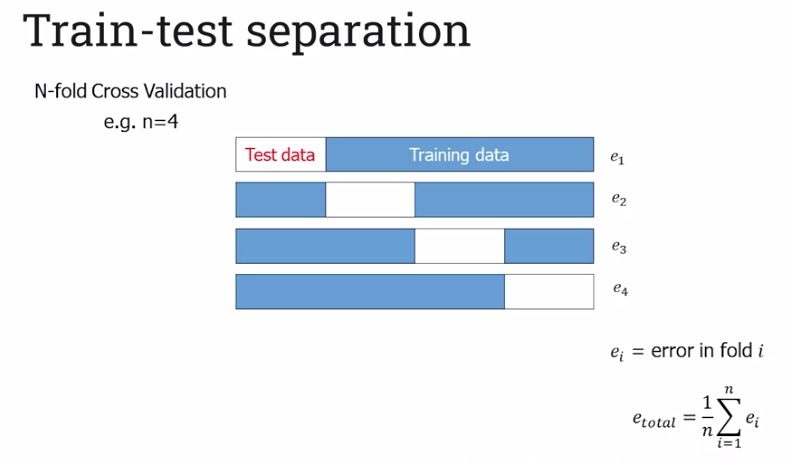
  

Essentially you split the data up into n-sections, in the example above the data is split into 4 sections. On the first go around, you use the first section as test data and the last three sections as training data. You train and then test, keeping track of your error score with this run.  
The next step you test with the second section and train with the remaining three sections. train, test, keep error score and repeat... The error of training is the average of the errors recorded.

N-fold cross-validation works well for evaluating algorithms with fixed parameters e.g. <Latex formula="k = 1" />, <Latex formula="distance = Euclidean" />, but what about a set of parameters? e.g. <Latex formula="k = \{1, 2, 3, 4, 5\}" />, <Latex formula="distance = \{Euclidean, Manhattan\}" />
We could keep the best parameters on the training set, but optimising on the training set leads to overfitting. We could keep the best parameters on the test set, but we shouldn't use test data for training.  

The solution instead is to on each iteration, split the data into test, train, and _validation_ sets. The validation set allows us to evaluate our hyperparameters. This is called N-fold nested cross-validation

##### N-fold nested cross-validation

We first split the dataset into a train and test set. This is our first fold. Within that fold, we then take that train set and subdivide that into an inner loop with a smaller training set and a validation set. We evaluate some of hyperparameters, k = 1 and Euclidean distance are the two hyperparameters. We train up our algorithm, we test it on the small validation set, we then change the hyperparameters, test out again on the validation set and so on. We go through all our possible hyperparameters and evaluate them. We then choose the best parameters, and feed those back into our original fold. This time we use our larger training set using the best parameters profound, and we evaluate them on our test set to get our final result for that fold, which we store.  so we'll have an error <Latex formula='e_1'/> for fold one. 

  

    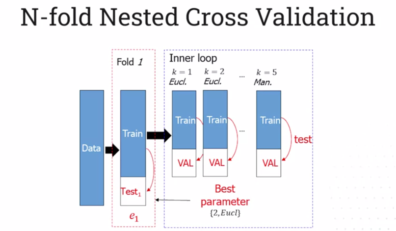
  

We then repeat the same thing for fold two, and then again for fold three and in fold four. We have this four fold nested cross-validation, where we take the average error over all over folds.

<Latex formula='e_{total}=\frac{1}{n} \displaystyle \sum_{i=1}^{n}e_i' centered={true} />

#### The curse of dimensionality

__N.B. Watch the lecture video on the curse of dimensionality__

#### Cross-validation lab notebook

<iframe
  src="/assets/cm3015/cross-validation.html"
  width="100%"
  style={{height: '70vh'}}
></iframe>

### Week 8: Probabilistic classification

#### Bayesian classification

Probabilistic modeling is a way of doing machine learning that allows us to deal with uncertainty. Real world data is noisy, and often a very rigid machine learning algorithm that has to output a yes or no doesn't quite cut it. With probabilistic modeling, we can output probabilities or degrees of uncertainty in a particular outcome. More often than not when we talk about probabilistic modeling, we've got Bayesian modeling in mind. Bayesian modeling is centered around the concept that new evidence can change our decisions. So we may believe something, but as the facts come in, as John Maynard Keynes said, you change your mind.  

The basic components of a Bayes model are the:

###### Prior

This is the initial degree of belief in some preposition. An example of such is 'The probability of me getting a good graduate job is 50%', or:

<Latex formula="P(good \space graduate \space job) = 0.5" centered={true} />

###### Posterior probability

This is the belief about a proposition after seeing some evidence. So now the probability of me getting a good graduate job, given that I know I attended a networking event will probably be slightly higher.

<Latex formula="P(good \space graduate \space job \space | \space attended \space networking \space event) = 0.5" centered={true} />

Ultimately, we want to calculate the posterior probability of an event, given the observed evidence. That can be difficult to do directly, as we'll need lots of examples of the evidence and then the corresponding outcomes to do it effectively. However, there is a way to calculate this probability indirectly, using a generative model of the likelihood that a certain outcome will lead to a particular observation. This can be achieved using a much smaller set of data, thanks to a formulation known as __Bayes' theorem__:

<Latex formula="Posterior = \frac{Likelihood \space \cdot \space Prior}{Marginal \space Probability}" centered={true} />

In the above, _Likelihood_ is the likelihood that the evidence was generated by the event, and _Marginal Probability_ ensures the posterior sums to 1 over all possible events.

##### Probability Rules

Imagine we have a square, and everything in there sums to 1. Now, if we have an event within that subsection of it (we'll call it the event A), that is the probability of A happening. Anything outside of that that within the yellow part is the inverse of this. 

  

    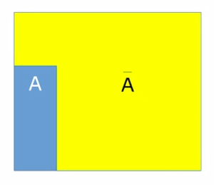
  

So the basic _inverse probability rule_ is the probability of an event is equal to 1 minus the probability of the inverse of the event.

<Latex formula="P(\bar{A})=1-P(A)" centered={true} />

Introducing another event, B, we can start to look at other concepts. The _conditional probability_ is defined here as the probability of B given that we know that A happened. 

  

    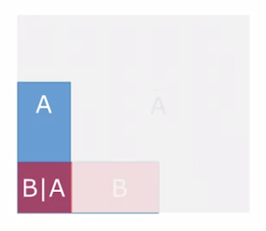
  

We've restricted a space to the area where A was, and we're just saying which portion of it B overlaps with

<Latex formula="P(B|A)" centered={true} />

We can look at specifically the probability of B and A happening together using the _product rule_. The product rule states that the probability of 2 co-occurring events is the same as the conditional probability of, in this case B, given we know A has happened, multiplied by the probability of A happening in the first place.  
This is a symmetrical rule, so we can also say that is also equal to the probability of A given we know B multiplied by the prior probability of B.

<Latex formula="P(B,A)=P(B|A)P(A)\\=P(A|B)P(B)" centered={true} />

Another rule that's very useful is the _sum rule_, and the sum rule allows us to essentially take certain events out of the equation.  
So if we sum up the joint probability of B and not A with B and A, we get the probability of B. What we're doing is we're marginalizing the variable A, we're removing A from the equation.

<Latex formula="P(B)=P(B,A) + P(B,\bar{A})" centered={true} />

And this can be combined with the product rule to give us quantity like this:

<Latex formula="P(B)=P(B|A)P(B) + P(B|\bar{A})P(\bar{A})" centered={true} />

Bayes' theorem formula can be derived by use of the product and sum rules as shown below (N.B. A and B are replaced with X and Y, as is often the case with ML texts).

  

    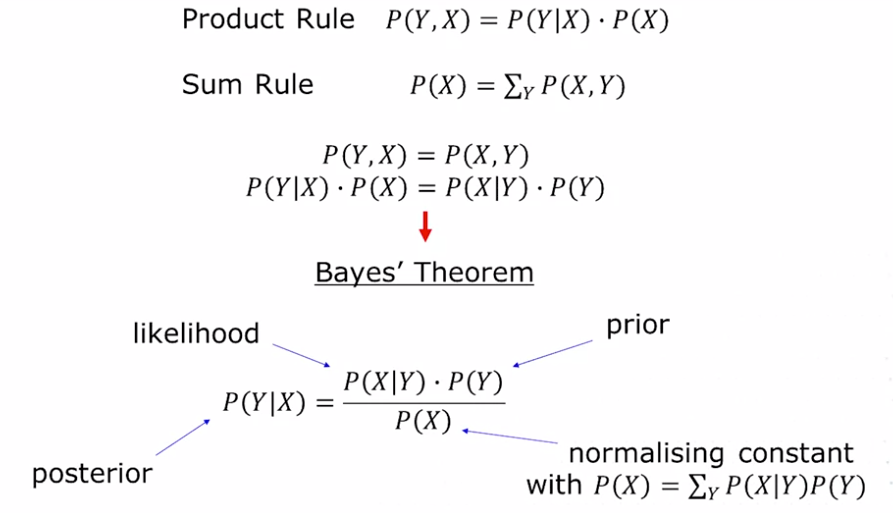
  

#### Naive Bayes classifier

Watch the lecture video on naive Bayes

#### Naive Bayes Lab Notebook

<iframe
  src="/assets/cm3015/naive-bayes.html"
  width="100%"
  style={{height: '70vh'}}
></iframe>