import Latex from '../../components/Latex.astro'

# Overview

The course is split up into two sections.  
The first is Machine Learning, and this will be lectured by Dr. Jamie Ward. He aims to cover the broader scope of machine learning, which will be theoretical in it's approach, though python code will be implemented along the way. Rather than just focus on neural networks, he'll cover linear regressions, decision trees etc. to give a more holistic account of the field.  
The second is Neural Networks, and this will be lectured by Dr. Tim Blackwell. This will be more hands on with implementations of neural networks from the get go.

# Topics

1. Introduction to Machine Learning and Neural Networks

> Key concepts:
> - applications of machine learning (and deep
> learning)
> - supervised and unsupervised learning
> - classification and regression  

> Learning outcomes:  
> - Explain fundamental machine learning
> concepts  
> - Describe various types of machine learning
> problem  
> - Describe various applications of machine
> learning  

2. Classification

> Key concepts:
> - K-nearest neighbour
> - Confusion matrices
> - Classifier evaluation  

> Learning outcomes:
> - Explain how a simple nearest neighbour
> algorithm works
> - Evaluate a supervised classification algorithm
> on a dataset
> - Describe the Decision Tree Classifier

3. Regression

> Key concepts:
> - linear models
> - gradient descent
> - data scaling

> Learning outcomes:
> - Explain the concept of linear regression and
> interpret results
> - Apply linear regression on a dataset
> - Explain the idea behind gradient descent

4. Model Improvement

> Key concepts:
> - bias-variance (overfitting, underfitting)
> - cross-validation
> - regularisation

> Learning outcomes:
> - Explain the effect of overfitting
> - Explain the concept of cross-validation
> - Explain how regularisation works

5. Probabilistic Classifiers

> Key concepts:
> - probabilistic modelling
> - bayes’ rules
> - naïve bayes classification
> - generative vs. discriminative modeling

> Learning outcomes:
> - Explain Bayes’ rule
> - Describe the Naive Bayes classifier
> - Discuss the difference between generative and discriminative models

6. Unsupervised Learning

> Key concepts:
> - k-means clustering
> - dimensionality reduction
> - linear projections

> Learning outcomes:
> - Explain the concepts of clustering and dimensionality reduction
> - Implement the k-means algorithm
> - Explain principal component analysis (PCA) and its properties.

7. Introduction to Machine Learning and Neural Networks - part 2

> Key concepts:
> - deep learning contexts
> - mathematical fundamentals
> - deep learning application
> - deep learning methodology

> Learning outcomes:
> - Describe multi-layer neural networks, backpropagation and deep networks
> - Explain machine learning workflow
> - Talk about the history and assess the future of deep learning

8. The mathematical building blocks of neural networks

> Key concepts:
> - the key mathematical concepts: tensors, transformations and stochastic gradient descent
> - sequence of data transformations
> - gradient descent optimisation

> Learning outcomes:
> - Understand the MNIST dataset
> - Understand how a simple neural network is built and trained with Tensorflow
> - Discover how data is packed into tensors and the fundamental of data representation of neural networks
> - Explain how a computer recognises hand written digits - our first neural network.

9. Getting started with neural networks

> Key concepts:
> - deep learning programs
> - training and validation plots
> - model evaluation
> - classification of movie reviews
> - multi-class classification

> Learning outcomes:
> - Understand the anatomy of a neural network
> - Apply neural networks to binary classification tasks
> - Apply neural networks to multi-class classification tasks
> - Apply neural networks to regression tasks

10. Fundamentals of machine learning

> Key concepts:
> - data preprocessing,
> - spotting and dealing with under- and overfitting
> - the universal machine learning workflow.

> Learning outcomes:
> - Know how and when to preprocess data
> - Know when a neural network is under-fitting or overfitting
> - Know how to address overfitting with network capacity reduction, weight regularisation and dropout

# Assessments
- Midterm coursework (50%)
- Final coursework (50%)

### Introduction to Machine Learning and Neural Networks

#### Applications and types of machine learning

Machine learning is a branch of artificial intelligence that in essence enables machines to learn by example. It is related to fields such as computer vision, signal processing, and data mining.  
Due to the increased availability of data, along with the increased amount of computational power available, we're seeing an increase in the use of machine learning algorithms and products that are part of our everyday lives, mobile phones, personal assistants, and so on.

Applications of machine learning include:
- face tracking and recognition
- body tracking (posture etc.)
- handwriting recognition
- speech recognition
- driverless cars
- recommender systems (ads, search etc.)
- generative machine learning
- sensor-based activity recognition

There are two main types of machine learning:
- supervised learning
- unsupervised learning

supervised learning operates on labelled data, whereas unsupervised does not

Imagine you were to be given a large amount of images of goats and xylophones.  
With supervised learning, the images would be labelled either goat or xylophone, and the supervised learning algorithm would be trained on the data to be able to accurately predict if a given image is either of a goat or a xylophone.  
With unsupervised learning the images would be clustered with respect to the contents of the images, with goat images clustering together and xylophones clustering together.  

An easy way to break down a typecal ML problem the following:

There is a third type of machine learning: _Reinforcement learning_

With reinforcement learning, the interest is predicting a sequence of actions that entail a specific reward

##### The machine learning 'black box'

See below a typical machine learning pipeline:

This essentially represents a training stage in a supervised learning algorithm.  
We want to approximate some mapping between x and y. That is, map the inputs to the outputs. An example of this process might be: given a set of images containing faces which we call x, and a set of output labels y which would be the identity of each of the people in the images, we can then learn a mapping that links the facial images to their identities.  
When a new data sample arrives, data that we haven't seen before indicated by x*, we can use this mapping that we've learned on x and y, the experience in the system, to provide a prediction which we call y*.  

If we have a look inside the black box, we find that even in supervised learning systems, most of the time, unsupervised learning methods are also used. In many cases as a pre-processing stage.  
This is useful as it usually reduces the number of variables that we have to analyze, making the task of learning a mapping from input to output less challenging.

### Week 3: Classification - part 1

#### K-Nearest Neighbours

One of the simplest and surprisingly effective algorithms for classification is K-nearest neighbors. This works along the basic premise that things are similar if they're closer together. Take an example where we have some images that we want to classify. We have a test image, which is a picture of a goat, and we want to find out what it is. In our training data set, we've got images of goats, and we've got images of xylophones.  
How do we detect what our test dataset is? Well, we could imagine comparing that test image to all the other images in the training dataset, and finding the one that matches it that is closest to it. And this is the basic premise behind K-nearest neighbors.

For example, if we were to look at a 2D problem, these images could be in a two-dimensional space. The X1 axis could be the noise that's made from these things. The X2 axis could be referring to an other feature, e.g. color etc.  

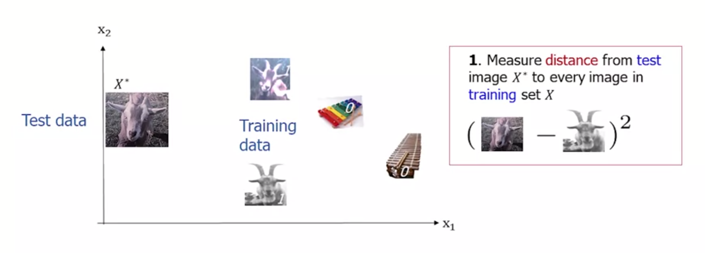

Now, if we want to find the distance between each of these things, we could use something like _Euclidean distance_, where the distance from <Latex formula='(x_1,y_1)' /> to <Latex formula='(x_2,y_2)' /> is:

<Latex formula='\sqrt{(x_2-x_1)^2+(y_2-y_1)^2}' centered={true} />

That allows us to very simply calculate the difference between two points in this case two-dimensional space.  
An alternative measure would be to calculate the _Manhattan_ distance. And that would be the direct up, and down, summed up: 

<Latex formula='|x_2-x_1|+|y_2-y_1|' centered={true} />

In this case, we're looking at Euclidean distance.  
We calculate the distance from our test image to each of the images on our training set. Then we find the one that is the closest, the shortest distance. And we can assign the label of the training data example, the one here that's marked with a red line, we can take that label and assign it to a test dataset. And that would allow us to classify our test data.

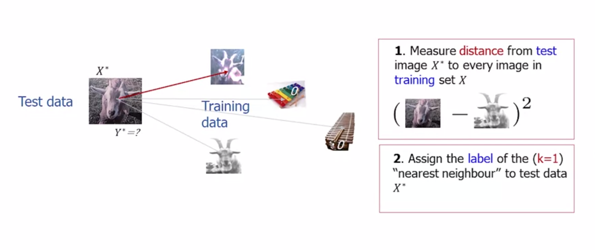

This simple example is K-nearest neighbor with K = 1. That is, it's the first nearest neighbor and the single test training image that is closest. But we could have K = 2, and that would be where we look at the two closest images, and if they've got the same label, then that's the label of our test image. And if they have different labels, then we have a confusion problem.  
K-nearest neighbors is a relatively simple algorithm with two main parameters. The first is K, which is the number of nearest neighbors that we're going to look for. And the second one is the similarity or the distance measure, which allows us to compare the different data points. And in this case we used Euclidean distance.

K-nearest neighbor is known as a _lazy learning algorithm_. That is, we don't generalize on the training dataset until we actually want to make a query.

#### Decision Trees

Decision trees are among the most versatile class of machine learning algorithm. They are capable of handling both classification and regression tasks and they're able to deal with complex, non-linear datasets. They're particularly useful as the basic classifier in random forests, which are among the most powerful class of machine learning algorithm. For this example, where we want to distinguish between two types of animal, rabbits or hares. Our data has at least two features, whether the animal can be found in a burrow or not, and its ear length.  

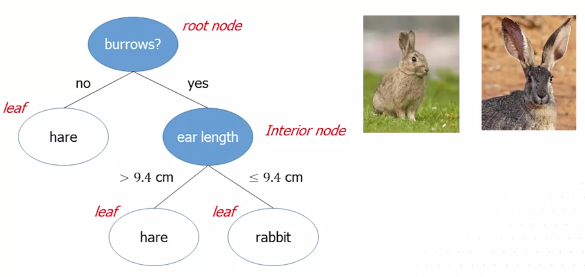

At the top of the tree, we have the root node, which asks a binary question of the __most distinguishing feature__ between the two classes (the feature that contains the most information). In this case, we know that hares almost never burrow under the ground, whereas all rabbits do. If the animal does not borrow, it is most certainly a hare. If the animal can be found in a burrow, we move on to how we can further separately using the second-most information feature, in this case ear length. This time we use a condition on this feature with values above a certain threshold designated as one class and equal to or below that threshold to the other class. The bottom-most nodes, where we make our final class designations, whether it's a rabbit or hare, are known as _leaf nodes_.

Decision trees are known as "White Box" models. This means that decision trees are easy to interpret. This is because they're based on a hierarchy of simple classification rules which are easily visualized. This is in opposition to black box models, like deep neural networks. In black-box models, decisions are made in a process which is far more opaque.  
With decision trees, we can easily traverse the tree by eye and see the criteria for how the decisions are made. If we were to plot some sample data on the feature space of this rabbit versus hare example, we might get something like the below:

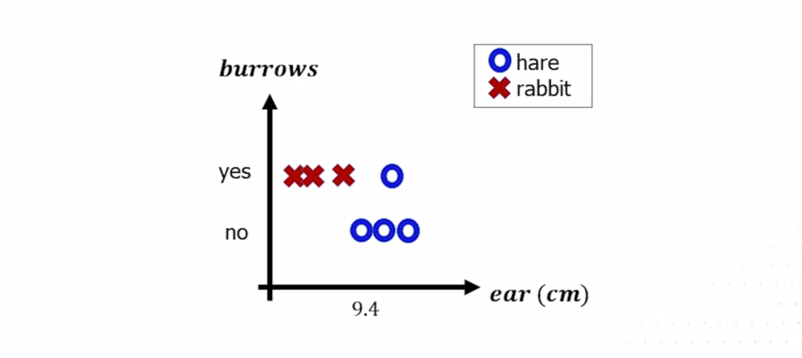

If we map the decision tree onto the space, we create what's known as a decision boundary. For example, the root decision divides the data into two areas, whether the animal burrows or it does not. Any new sample that falls into the no side, so lower down on the y-axis, the burrows feature, that would be classified as a hare.

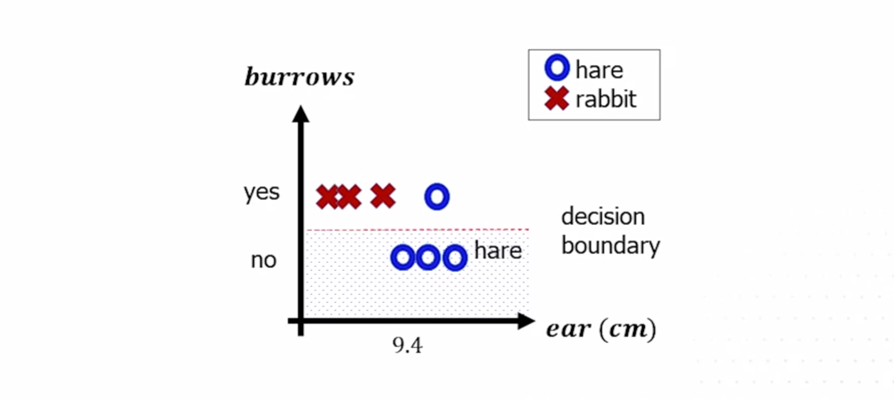

The second level decision on ear length only then applies to data that has had a yes to burrowing. 

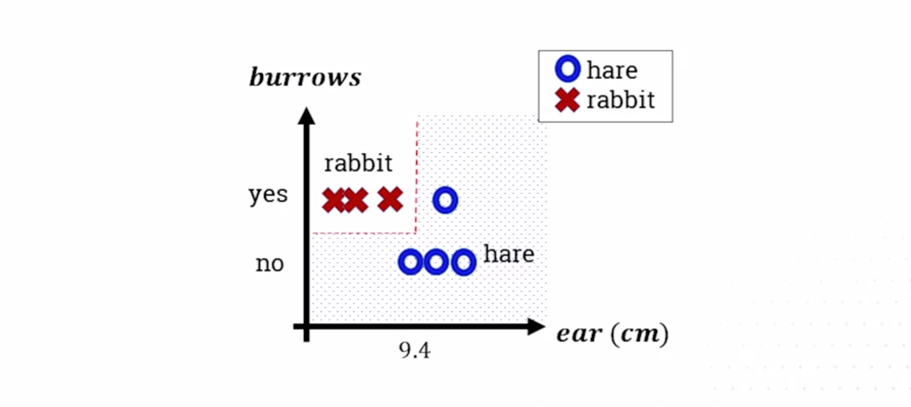

Continuing in this vein, adding decision criteria and making the tree much deeper, can lead to very complex and non-linear decision boundaries. They can capture almost any shape.

There are different types of decision tree algorithm, but they broadly work along a similar principle. One common type is __Classification and Regression Decision Tree (CART)__. This is a binary tree that as its name suggests, can be used for both classification and regression. Imagine we have a dataset containing samples of two classes, crosses and circles. The goal is to fit a decision boundary that can best separate these two groups.

  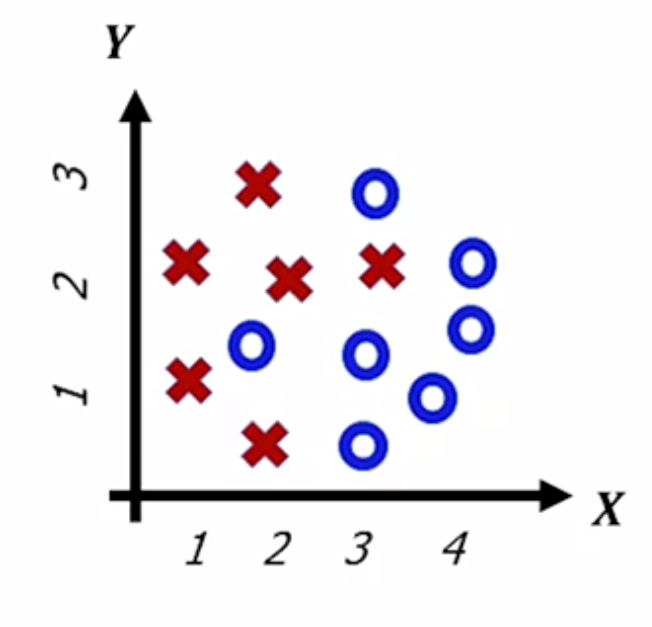

The algorithm works as follows. Starting with a root node, find the combination of a single feature, in this case either x or y, and a threshold value that best splits the entire dataset in two. This data reveals feature x with a threshold of three. The choice of where to split the data is based on _minimizing the impurity_ of each of the two decision regions. That is aiming to have the most crosses in one region and most circles in the other.

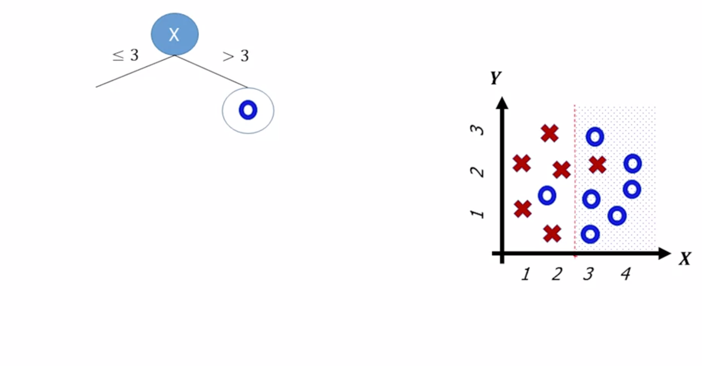

If a region is impure, that is it contains a mixture of classes, we grow the tree on to a second level split. This node then acts as a new route on a subset of the dataset for all examples where x is greater than three. By splitting the y-axis at two, that subset uncovers a new region which contains only circles. The impurity is zero for this, so we can actually define a leaf node and stop recursing down that branch. 

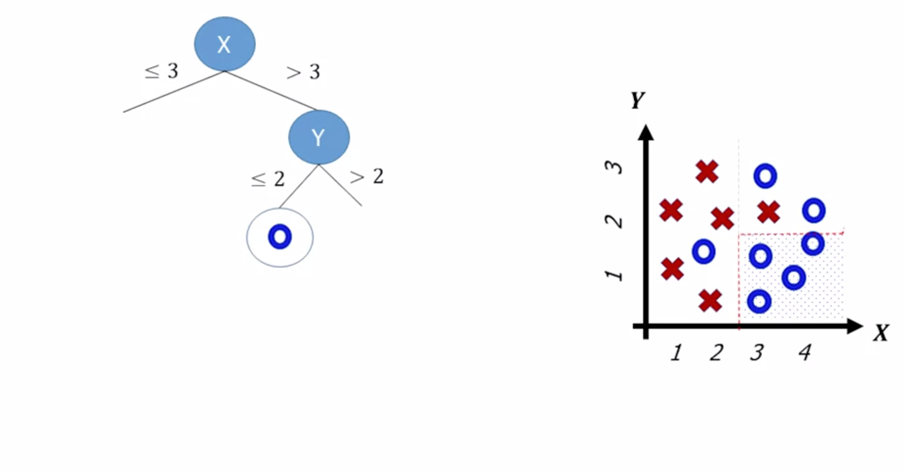

The remaining subgroup of data still contains a mixture of circles and crosses, so we continue to recurse. A further split in the y feature helps us to create a new leaf, and so on. The final split on this side of the tree reaches two leaves, which perfectly partitions all the data for x is greater than 3.

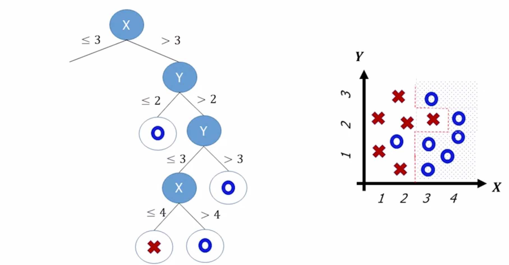

The algorithm can then return to the original root node, and the same procedure traverses down the left side of the tree for x is less than or equal to three, until we reach the final tree that perfectly divides the dataset. 

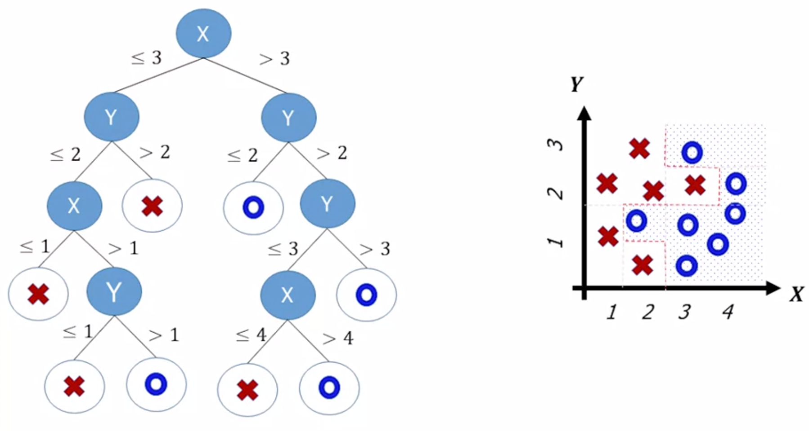

Growing a tree and creating an ever more complex decision boundary is a major advantage of decision trees, in that it can be used to capture complex relationships in the data. However, the danger of a decision tree is that they're prone to overfitting. This is where they fit training data perfectly, but perhaps too well, so much that they might not be able to generalize to new data that hasn't been seen before. This follows from the principle of Occam's Razor, where often a simpler solution is preferable.

A simple solution to solve this is to force the algorithm to be simpler, to _regularize_ it. One way to do this is to restrict the depth of a tree, forcing leaf nodes to be formed despite the fact that there may be misclassifications. Alternatively, we could grow the tree fully and then prune it afterwards to find the best compromise solution. This is often the preferred approach. 

Finding the optimal split and feature combination is an np-complete problem. It's computationally intractable even for small datasets. The __CART__ algorithm described here uses _greedy training_. That is, it computes only the optimal split at each node and sequence, but doesn't consider the optimization of the tree as a whole. It often provides a good overall solution despite not being optimal.  
A further advantage of decision trees over many other algorithms, including K-nearest neighbor, is that the algorithm can work on raw feature data without the need for data pre-processing. There's no need to scale or to center the data before-hand.  
Decision trees are incredibly powerful algorithms and very flexible, and although we've covered them using classification, they can also be used for regression tasks. They're are also used as the base algorithm in one of the most powerful types of machine learning: Random Forests.