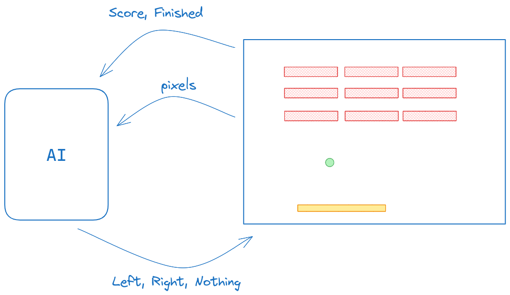
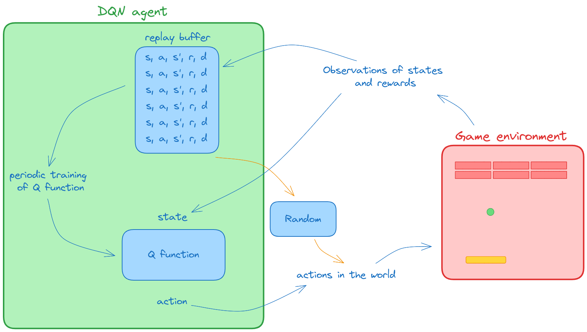
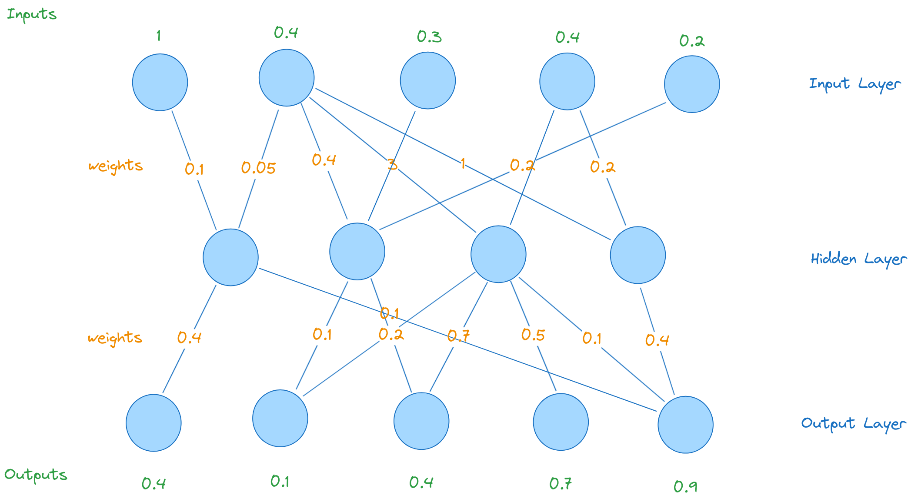
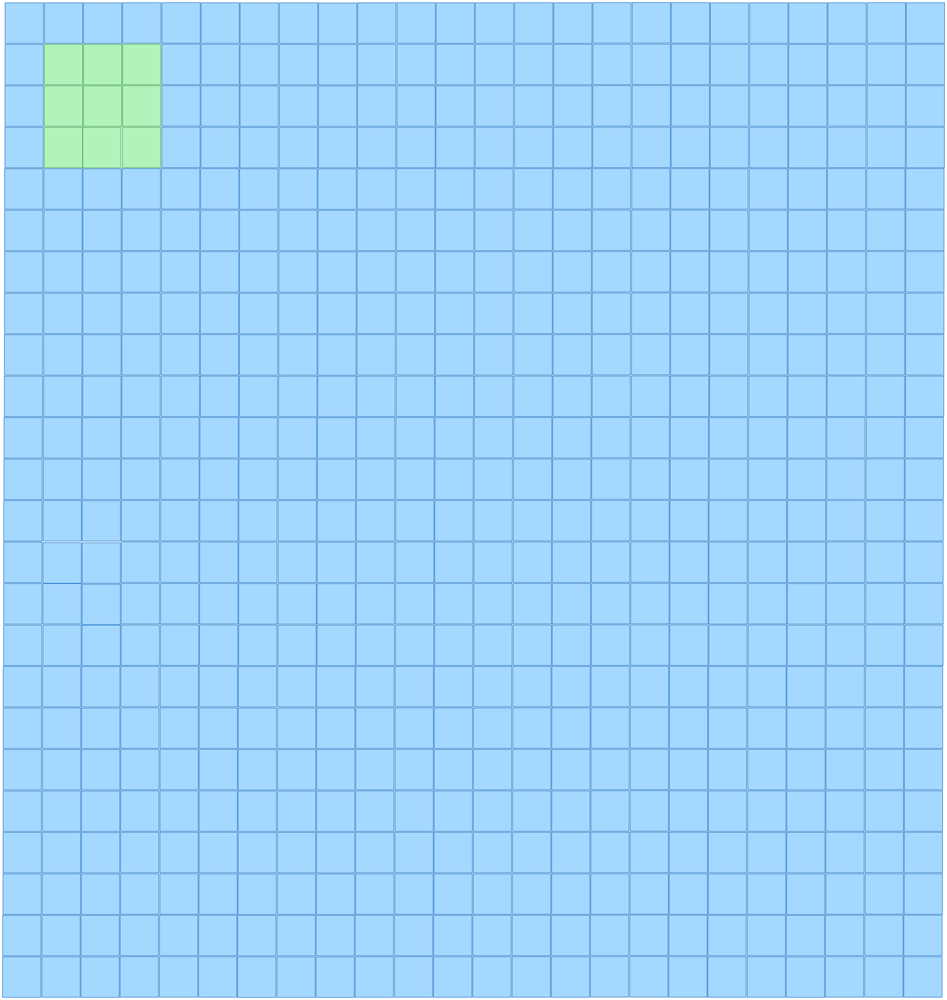
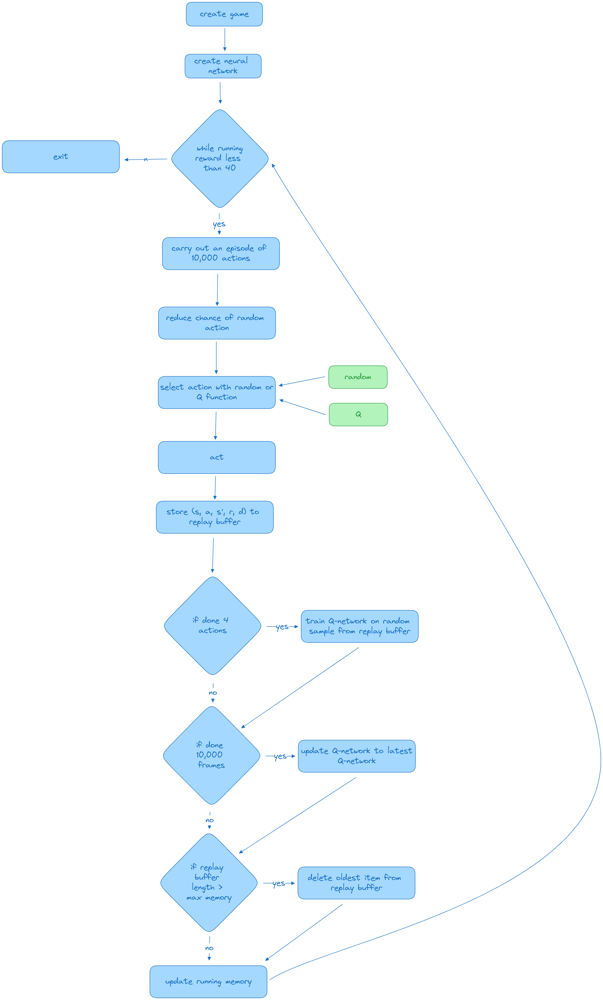
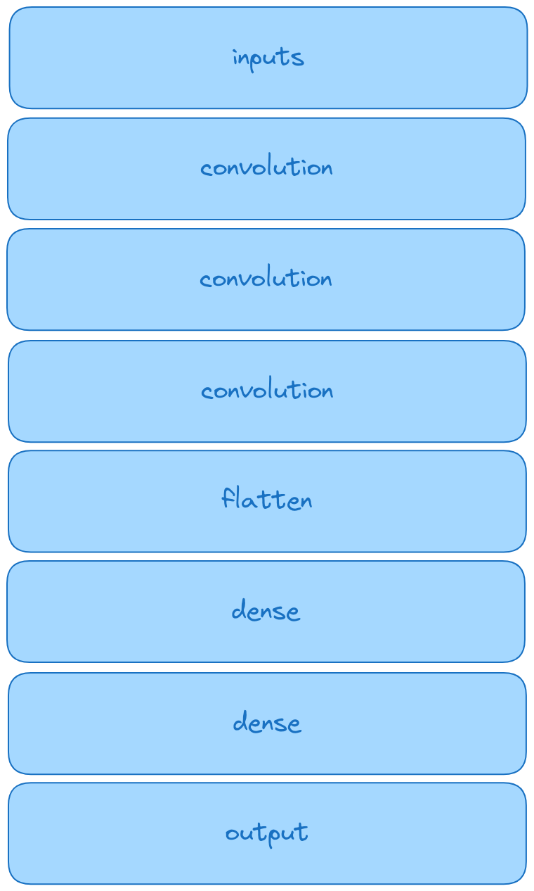
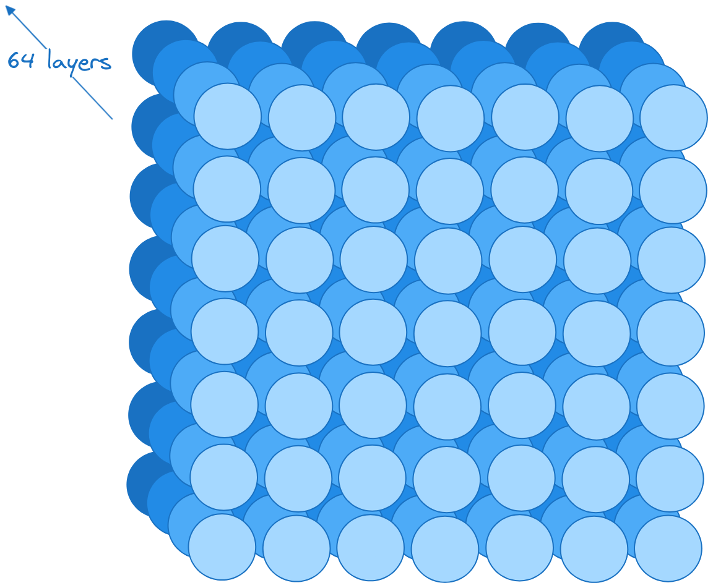

import Latex from "../../components/Latex.astro";

# Overview

The course will be focused on four case studies, where there will be a deep-dive into four particular AI systems. These case studies will be:

- AI game player (DeepMind 2015 paper)
- Robot Scientist
- Evolving creature (Karl Sims '90s paper)
- Creative AI

## AI game player

This case study is organised into five weeks of content:

**Week 1:** Introduction to AIs that play video games and reinforcement learning  
**Week 2:** Formalising reinforcement learning and the Deep Q Network agent  
**Week 3:** Tooling - openai gym, keras and convolutional neural networks  
**Week 4:** Implementation of the DQN agent  
**Week 5:** State of the art and ethics in AI game players

[Week 1 slides](https://d3c33hcgiwev3.cloudfront.net/DyzJxEt8QSasycRLfNEmCQ_20f82746a30348cebf9eeb4009b768e1_ai-game-player-wk1.pdf?Expires=1697587200&Signature=LOz6LjYolfeBEUfLY7~V~Vcjmi5dstUjgZI-KtLxdpBdchoDkB7W95ZibbMG0pTaX57cOmeriR3mXzPWLBG7SrLRamkXHmpBPGroXouVAvJKBPisJwC37u2mi8eDlubrjKrOLHXFRERFAMo5JGmshH46EKzXmn1gbCGxHZxAkiE_&Key-Pair-Id=APKAJLTNE6QMUY6HBC5A)

### Week 1: Introduction to AIs that play video games and reinforcement learning

We'll be looking at the 2015 research paper from DeepMind, where they developed a system called Deep Q Networks.  
They built a game-playing agent using this technology, which was able to get human competitive levels of gameplay technique across a range of different retro video games, specifically Atari.

#### Playing games with AI

why play games with AI?

> _"Games are interesting because they are too hard to solve"_  
> **Stuart, Norvig, "Artificial Intelligence: A Modern Approach"**

Games contain all kinds of interesting, hard to solve problems e.g. if you're playing a fast action game, how do you analyze the visual input quickly enough so that you can act in an effective way?  
If you're playing a more long term strategy type game, how do you make sure that you can develop a strategy and adapt it dynamically as conditions change?  
There's all kinds of classic problems from AI to do with hidden information, planning and visual analysis, all kinds of things that come out when you try and play games with AI

#### Commercial interests in AI game playing

> _"Relying exclusively on playtesting conducted by humans can be costly and inefficient. Artificial agents could perform much faster play sessions, allowing the exploration of much more of the game space in much shorter time"_  
> **Zhao et al, "Winning Isn't Everything"**

#### The role of competitions

Competitions have the role of providing software, interfaces and scoring procedures to fairly and independently evaluate competing algorithms. These competitions motivate researchers. Existing algorithms get applied to new areas, and the effort needed to participate is less than it takes to write new experimental software

#### Moravec's Paradox

Moravec's paradox is the observation in artificial intelligence and robotics that, contrary to traditional assumptions, reasoning requires very little computation, but sensorimotor and perception skills require enormous computational resources.  
The principle was articulated by Hans Moravec, Rodney Brooks, Marvin Minsky and others in the 1980s.

> _"it is comparatively easy to make computers exhibit adult level performance on intelligence tests or playing checkers, and difficult or impossible to give them the skills of a one-year-old when it comes to perception and mobility"_  
> **Hans Moravec, 1988**

This paradox leads to the trend of generalisation in game-playing AI's

#### When will it end?

> _"An ultimate goal that would demonstrate that an AI system can fully master a game, beyond extrinsic factors of human vs. human competitions, would be to allow anyone to play against it over a long period of time"_  
> **Justensen, Niels, Debus, Risi, "When are we done with games?"**

Teams like OpenAI and DeepMind have done just that, putting DOTA5 and AlphaStar online for humans to play against. According to researchers however, the games are somewhat constrained to certain scenarios and so are not completely fair.

### AI game player milestones

| Year |                                                                   Event                                                                   |                                                                                          Paper                                                                                          |
| :--: | :---------------------------------------------------------------------------------------------------------------------------------------: | :-------------------------------------------------------------------------------------------------------------------------------------------------------------------------------------: |
| 1950 |   Seminal work on chess playing algorithms by Claude Shannon, where he defined the first formal definition of a chess playing algorithm   |                                          Shannon, C. 'Programming a computer for playing chess', Philosophical Magazine 41(4) 1950, pp.256–75.                                          |
| 1952 |                                                The first checkers/drafts playing algorithm                                                | Strachey, C. 'Logical or non-mathematical programmes' in: Proceedings of the Association for Computing Machinery Meeting (New York: Association of Computing Machinery, 1952) pp.46–49. |
| 1979 |                                          A backgammon computer algorithm beats a world champion                                           |                                     Berliner, H. 'Backgammon computer program beats world champion', Artificial Intelligence 14(2) 1980, pp.205–20.                                     |
| 1989 |                   The Computer Olympiad is created (still running today). A competition for computer vs. computer games                   |                                                                                                                                                                                         |
| 1992 |                                        A world championship caliber checkers program is published                                         |                                  Schaeffer, J. et al. 'A world championship caliber checkers program', Artificial Intelligence 53:2–3 1992, pp.273–89.                                  |
| 1997 |                                               IBM's Deep Blue beats Garry Kasparov at chess                                               |                                      Campbell, M.A., J. Hoane Jr and Feng-hsiung Hsu 'Deep blue', Artificial Intelligence 134(1–2) 2002, pp.57–83.                                      |
| 2002 |                                             World-championship-caliber Scrabble was reported                                              |                                          Sheppard, B. 'World-championship-caliber Scrabble', Artificial Intelligence 134(1–2) 2002, pp.241–75.                                          |
| 2007 |                                                        Completely solved checkers                                                         |                                                   Schaeffer, Johnathan et al "Checkers is solved", Science 317.5844 (2007): 1518-1522                                                   |
| 2009 |                        Mario AI competition started (ran until 2012). It inspired other game competitions to start                        |                                              Togelius, J. et al. 'The Mario AI championship 2009–2012', AI Magazine 34(3) 2013, pp.89–92.                                               |
| 2015 |                                 Important paper published by DeepMind w.r.t AI agents playing Atari games                                 |                                      Mnih, V. et al. 'Human-level control through deep reinforcement learning', Nature 518(7540) 2015, pp.529–33.                                       |
| 2016 |                         A world-champion beating Go algorithm created, again by DeepMind (documentary on Youtube)                         |                                         Silver, D. et al. 'Mastering the game of go without human knowledge', Nature 550(7676) 2017, pp.354–59.                                         |
| 2018 |                Superhuman poker playing AI created, beats top pros at version of poker widely accepted as hardest version                 |                       Brown, N. and T. Sandholm 'Superhuman AI for heads-up no-limit poker: Libratus beats top professionals', Science 359(6374) 2018, pp.418–24                        |
| 2019 |                OpenAI creates DOTA II playing AI, DOTA 5 that competes with world champions (in constrained circumstances)                |                        Raiman, J., S. Zhang and F. Wolski 'Long-term planning and situational awareness in OpenAI five', arXiv preprint arXiv:1912.06721 (2019).                        |
| 2020 | DeepMind releases Atari57, which beats top players in ALL 57 Atari games. Important stepping stone to the idea of general problem solving |                            Badia, A.P. et al. 'Agent57: Outperforming the atari human benchmark', International Conference on Machine Learning. PMLR, 2020.                             |

### How might one build a game playing AI?

#### Context

We are going to look in depth at the DQN agent from the Atari DeepMind 2015 paper. You might ask why this one and not the 2020 paper that was improved? The 2015 paper can be seen as a more pure implementation of concepts and is manageable for this course. The 2020 paper has added complications that does not lend itself to the scope and length of this course.

#### Possible steps

- play the game, reflect upon the decisions being made:
  - how are points won?
  - which way is the ball going?
  - where are the bricks?
  - how can I get the ball on the correct side of the bat? etc.
- develop a model of the game playing agent:
  - it wants to be as close to the human playing the game as possible e.g. rather than being given the coordinates of the ball, bat and bricks etc., the agent will just receive the RGB values of the screen, much like a human perceives the game
    
- consider how to design the AI
  - maybe just create a big input-output data set and train a network
  - but what does that data set look like? Is it going to have every possible screen that it could ever see? And is it going to say exactly what the correct move is to make in every possible screen? If so, how do we create that data? Do we get someone to meticulously label all the millions of possible screens?

##### Reinforcement learning

> _"How agents can learn what to do in the absence of labelled examples of what to do."_  
> _"Imagine playing a new game whose rules you don't know; after a hundred or so moves, your opponent announces, you lose. This is reinforcement learning in a nutshell"_  
> **Stuart, Norvig, "Artificial Intelligence: A Modern Approach"**

From the descriptions above, it seems that reinforcement learning is an appropriate set of algorithms to be investigating. Later on, we'll formally describe the reinforcement learning problem. For now however, think about what the following are in terms of the breakout game:

- states
- actions
- rewards

These are the key elements of a reinforcement learning algorithm

### Week 2: Reinforcement learning and DQN agents

[week 2 slides](https://d3c33hcgiwev3.cloudfront.net/pOwpiMA_S2usKYjAP6trnA_b197a6de118644d19f31be9557fd10e1_ai-game-player-wk2.pdf?Expires=1698105600&Signature=E81mamWXdceYZY0Wv2LAOyn6hbQ1snO6vrA-MuijBU99GTtmLxQ3ZqVhAtbSM-YFqpOv4Fl3ictZK4-LsdraHOLSQ3fp22cnf8LPS4mrLFY4nslPeVWPh-bm-2~5elDTvcR6fls6RGPOJ8L0os2RCaZ0v6y7973Y5Yz2rDxVMpY_&Key-Pair-Id=APKAJLTNE6QMUY6HBC5A)

#### Formalising the problem

How can we create an AI that can play games? Most games involve an iterated process of observing and acting. Most games involve some sort of positive or negative result. Think of an arcade game:

- what are the observations?
- what are the vailable actions?
- what is the result and when is it received?

In the case of breakout:

- the state is the current view of the game
- the actions are move left, move right or stay still
- the reward is 1 point each time you hit a brick or game over if you miss the ball

##### formalising this

The player observes state <Latex formula='s' />  
The player takes action <Latex formula='a' />  
The player observes the next state <Latex formula="s'" />

<Latex formula="s,a \rarr s'" centered={true} />
This is stochastic, so we can add probability <Latex formula="P" /> to the transition:
<Latex formula="P(s'|a,s)" centered={true} />> The reason it is stochastic is that
the ball can be moving in any direction, and a snapshot of the screen (state) does
not indicate which direction the ball is moving. You can read the above expression
as '_probability of state prime, given state and action_'

##### rewards

There is a reward associated with the <Latex formula="s,a,s'" /> construct

<Latex formula="s,a,s',r" centered={true} />
So, taking action <Latex formula="a" /> in state <Latex formula="s" /> leads to state <Latex formula="s'" /> and
a reward of <Latex formula="r" />
We can say that the reward is a function on the <Latex formula="(s,a,s')" /> construct
<Latex formula="R(s,a,s')" centered={true} />

> Think of breakout, when you go from a state of 7 bricks to 6 bricks, you gain a point

##### Markov Decision Process

We have ourselves a **Markov Decision Process** which is a way to formalise a <mark>stochastic sequential decision problem</mark>

state transition: <Latex formula="P(s'|a,s)" />  
reward function: <Latex formula="R(s,a,s')" />

> stochastic - pertaining to probability, sequential - due to the nature of having to make a series of decisions

The _decision_ in this particular MDP is what action to take next in the game

#### Value functions and DQN

##### Action policy

How do we decide what action to take in a given state?

The **action policy** tells us what to do in a given state

policies are denoted <Latex formula='\pi' />, so:

<Latex formula="\pi (s) \rarr a" centered={true} />

> The policy for state <Latex formula='s' /> is to take action <Latex formula='a' />  
> the policy is simply a mapping between state and actions

What is a optimal policy?

Remember, this is a sequential decision problem, not a "one shot". The reward might come in the _far future_ (as opposed to say an image classifier which has instantaneous reward feedback).  
Therefore an optimal policy maximizes reward over a sequence of actions.  
The action you take now should unlock maximum potential rewards going into the future.  
The Bellman equation formalises this.

##### Bellman equation

<Latex
  formula="V^*(s,a)=\underset{\pi}{max}\sum [r_t + \gamma r_{t+1} + \gamma^2 r_{t+2} + ... | s_t=t, a_t=a, \pi]"
  centered={true}
/>

Breaking it down:

<Latex formula="V^*(s,a)" />
> The value of action <Latex formula="a" /> in state <Latex formula="s" />{" "}

<Latex formula="r_t" />
> The immediate reward for taking the action (actually the <Latex formula="r" /> from <Latex formula="(s, a, s', r)" /> mentioned
earlier){" "}

<Latex formula='\gamma r_{t+1} + \gamma^2 r_{t+2} + ...' />
> The value of the reward in the next (future) time step, scaled by gamma (< 1), plus The value of the reward in the step after that, scaled by gamma squared and so on.  
> Essentially this is saying, "further in the future we're not that confident of what will happen, so we'll take less of that reward"

<Latex formula="\underset{\pi}{max}" />
> Choose the most valuable thing in the action policy at every time. So <Latex formula="\pi" /> is
the action policy, <Latex formula="max" /> is just saying the highest.

Bringing all of this together:

> The value of action <Latex formula='a' /> in state <Latex formula='s' /> is the reward for <Latex formula='s' />, plus the maximum possible future reward for states <Latex formula='s' /> at time <Latex formula='t' />, increasingly discounted by factor <Latex formula='\gamma' /> raised to the power of <Latex formula='t' />.  
> **N.B.** We did not include the probability of state transitions here.

But what are the future states and rewards?

The **state transition matrix** tells us how the state will change over time based on our chosen actions.  
The **action policy** dictates what the chosen actions will be in each state. It involves choosing the highest value action.  
The problem is we need to know the complete transition matrix and the associated rewards to make an action policy – not easy for Atari games! (too many possible combinations of state and most have zero reward)

The answer to the incomplete MDP data is to approximate the value function - that function is the **Q function**

##### The Q-function and Q-learning

<Latex
  formula="Q^*(s,a)=\underset{\pi}{max}\sum [r_t + \gamma r_{t+1} + \gamma^2 r_{t+2} + ... | s_t=t, a_t=a, \pi]"
  centered={true}
/>

(just swap out the <Latex formula='V' /> for a <Latex formula='Q' />)

Q-learning involves learning the best Q-function that we can, <Latex formula='Q^*' />:

Q-learning is essentially saying:

> "I'm not going to have a perfect value function. I don't worry about that, but I'm going to try and get my best approximation of what the value function is. So I'm going to somehow through observation, learn what the value function is."

So instead of having to know the state transition matrix and the action policy, we somehow _learn_ the mapping between states and actions, and the value of a given action in a given state.  
So all we need to know is the state and the action, and then we can find out what the value is.

There are various methods to do Q-learning, but most of them don't work for real problems. The one that works here is to use a _deep neural network_, hence:

Deep Q Network (DQN)

#### DQN agent architecture

> **agent**  
> An entity that can observe and act autonomously

We need an agent architecture that solves two problems:

1. no state transition matrix
2. no action policy



The DQN agent consists of two main components, the **replay buffer** and the **Q function**.

The replay buffer gathers observations of:

- states
- actions taken in those states
- what the next state was
- what the reward was
- whether the game was done at the end of that or not.

So the replay buffer consists of many hundreds and thousands of observations of what's happened as the agent is taking actions in the world.

As shown above, the Q-function tells us in the given state what the value of all the available actions are, so that the agent can choose the highest value action.

The behavior of the agent is to collect observations, periodically stopping to train the Q-function up on its current set of observations (or some batch of them).

##### Epsilon greedy exploration

The method that the agent uses to fill up the replay buffer is called 'epsilon greedy exploration'.

In the beginning the agent has no Q-function, as the replay buffer is empty so no training has been done. At this point, the agent uses a random function to randomly choose actions to take, and then add to the replay buffer.  
Periodically it will train the Q-function on the values added to the replay buffer.  
As time progresses, the agent begins to rely more and more on the Q-function to decide actions it takes in the world. This is what the 'greedy' refers to in epsilon greedy.  
So at the beginning you start with zero 'greed', and as epsilon increases, we more and more start relying on the burgeoning, growing, learning Q-function to select our moves.

The beauty of this approach is its ability to kickstart the agent with somewhat random exploratory behavior. However, as the agent learns and the Q-function improves with time, it gradually shifts from this exploratory phase to adopting a more concrete, effective policy that leads to rewards.  
It's important to note that behaving randomly typically doesn't result in rewards. The agent endeavors to identify basic patterns or sequences, albeit in a somewhat random manner, that have the potential to yield rewards.  
Eventually, the Q function helps the agent piece these basic patterns together into more significant sequences. In essence, this approach involves refining the agent's behavior over time to align more closely with its acquired knowledge of the environment, presenting an elegant solution.

#### The loss function for DQN

The Q-function is a neural network. We train it on the state transition data, but remember it does not infer next state. It infers the value of an action in a state taking into account future rewards.

But how do we train a neural network? Typically, in the training of a neural network, a fundamental requirement is access to 'ground truth' data, which consists of a labeled dataset comprising both inputs and corresponding outputs. This dataset instructs the network by specifying that when a particular input is provided, the expected response should be a certain output. During the training process, the neural network is presented with inputs, and the correct output is already known. An evaluation is then performed to check the disparity between the actual output generated by the network and the expected output. This disparity is quantified as the "loss."

The loss is computed across the entire training dataset. The remarkable aspect of neural networks is their capacity to use this loss, and feed this information back into the network's weights. This feedback mechanism allows the neural network to adjust itself, with the aim of improving its performance in subsequent tasks. This is in essence the training process, and it is fundamentally underpinned by the principle of backpropagation.

In this instance however, we don't know what the correct output should be because the correct output is the correct value for each of the moves, and each of the states.  
The only thing we have in our replay buffer is the immediate reward that a given action will give us. We don't have the reward going into the future. We would need to somehow analyze it, and build a state transition matrix, but it would be computationally infeasible to do that.

How do we get around this? The answer is the loss function.

##### Loss function

The below loss function represents the error between the Q-values predicted by the neural network and the expected Q-values derived from the immediate reward and the maximum future reward:

<Latex
  formula="L_i(\Theta_i)=\sum_{s,a,r,s'}U(D)[(r+ \gamma \underset{a'}{max}Q(s',a';\Theta_{i}^{-})-Q(s,a;\Theta_i))^2]"
  centered={true}
/>

Breaking it down:

<Latex formula="\Theta_i" />> The current network weights

<Latex formula="L_i(\Theta_i)" />
> The loss of the current network. It's a measure of how far off the predicted Q-values, <Latex formula="Q(s,a;\Theta_i)" />
, are from the target Q-values

<Latex formula="\sum_{s,a,r,s'}U(D)" />
> take a _uniform random sample_, <Latex formula="U" />, from the replay buffer <Latex formula="D" /> to
yield a training set that consists of states, actions, rewards and next
states{" "}

<Latex formula="r+ \gamma \underset{a'}{max}Q(s',a';\Theta_{i}^{-})" />
> This is the estimate of what the network _should_ output > This uses an older version
of the network, <Latex formula="\Theta_{i}^{-}" />, to get the gamma-weighted
Q-function value with the older network weights, plus the actual reward that we
know (r is in the dataset).

<Latex formula="(r+ \gamma \underset{a'}{max}Q(s',a';\Theta_{i}^{-})-Q(s,a;\Theta_i))^2" />
> Compare the estimate of what the network _should_ output with what the current
(training) network yields and calculate the squared error (Euclidean distance)

#### Visual processing and states in DQN

###### State secret sauce: three frames

If the neural network is only being passed a single frame of the game at a time, how does it know which direction things are moving in? Typically if you're modelling sequential data, you use a recurrent system such as an LSTM network. DQN doesn't use a recurrent network. Instead, the state that gets fed in is three frames. It looks at the last three frames.

###### Image processing: max value

An artefact present in the atari 2600 was that it was only possible to display a limited number of sprites on the screen at once. This mean that often, some sprites were displayed on the even frames and others on the odd frames. Your brain/eyes would do the work to make them look like they were all on the screen at the same time.  
To get around this, each pixel of each of the three frames fed in (mentioned above) were actually max color values of two contiguous frames. As the background was black, this means all sprites would show on a single frame.

###### Image processing: grey scale

The Y-channel (luminance) was extracted from each frame and used instead. This reduced the data from three values per-pixel to just one.

###### Image processing: resizing

The frames were then resized from 216 pixels to 84x84 to reduce data size further.

### Week 3: Tooling - openai gym, keras and convolutional neural networks

#### Open AI gym

What is openai gym?

- A way of providing standardised environments for reinforcement learning algorithms to operate in
- Allows the developer to focus on their agent instead of the simulation
- Includes versioned, standard set of environments enabling easy comparison

There are various gym-like systems:

- arcade learning environment (2013)
- visdoom (2016)
- openai gym (2016)

common openai workflows:

```python
# listing all known environments
x = gym.envs.registry.all()

# make games
ll_env = gym.make('LunarLanderContinuous-v2')
bw_env = gym.make('gym_gs:breakwall-v0')

'''
basic gym runtime
'''

# reset the game
ll_env.reset()

# initiate a step in the game,
# passing the actions as arg(s)
ll_env.step([0, 0])

# render the resultant game frame to screen
ll_env.render()

'''
action space
'''

# list space of actions you can take
ll_env.action_space
bw_env.action_space

# take a random action
ll_env.action_space.sample()

# stepping and acting
for i in range(1000):
  act = ll_env.action_space.sample()
  ll_env.step(act)
  ll_env.render()

'''
stepping returns some variables in a tuple
'''

o,r,d,i = ll_env.step([0,0])
# o (observations) is the 's' from the MDP
# r is the r (reward)
# d is 'done' (wether or not the game is finished)
# i is game diagnostic info
```

#### Introduction to Keras and neural networks

###### What is a neural network?

> A set of processing units (nodes/neurons) connected together into a ‘neural network'

Essentially, you feed some numbers in one end and other numbers come out of the other end

Training a neural network involves incrementally adjusting the settings of the processing units until they cause the correct outputs to come out in response to a set of inputs.  
DQN uses a neural network to learn the Q function, the input is game state and the output is values of all actions

###### What is Keras?

> High level neural network API sitting atop tensorflow

##### Layers

Neural networks are made out of layers. Deep neural networks typically have quite a few layers.  
There are different types of layers with different nodes in them which process the signal in different ways.



Keras provides lots of different [layer types](https://keras.io/api/layers/)

###### core layers

- dense layer
- activation layer
- embedding layer
- masking layer
- lambda layer

###### more elaborate layers

- convolution layers (great for image processing)
- recurrent layers e.g. LSTM, GRU (great for sequential data)
- attention layers (even better for sequential data processing)

**DQN uses some common layers plus some convolutional layers**

##### Activation functions

Activation functions dictate how certain types of nodes transfer the signal from input to output.  
The activation function is based on a biological metaphor of neurons in the brain. If the sum of all the signals coming in is high enough, then the neuron will fire.  
This is the most basic activation function. There are others e.g. Linear (as the input increases, the output increases), Sinusoidal etc.  
The _purpose_ of an activation function is to control when the neuron outputs or how much output, so it can combine lots of inputs and respond to those.

##### Weights

Weights dictate the behaviour of a layer, e.g.

- scaling the value of connections between nodes
- configuring the properties of more complex layers

The weights interact with the activation function. Weights are the elements that are adjusted over time with training.

##### Loss function

Loss functions dictate the error between the achieved and expected outputs. The loss is fed back into the network using back propagation.

There are built-in loss functions but you may want to define your own, e.g. if you do not know what the correct expected output is (no ground truth).  
DQN uses a custom loss function based on the Bellman equation

##### Complete picture

1. Build model from layers
2. Initialise weights
3. Feed in batch of inputs
4. Calculate loss on outputs
5. Back propagate loss into the network
6. Back to 3

#### Convolutional layers

###### What is convolution?

> Convolution is a filtering technique, often used for images but also other signals.

Essentially, you calculate the new value for a pixel by adding together scaled values of the original pixel and its surrounding pixels.

examples of convolutions:

- blur
- edge detection

###### How does convolution work?

A filter moves over the pixels of an image, and at each step scales the pixels within the <mark>filter kernel</mark> and sums them.



###### example filter kernels:

blur:

```python
[
  [0.5, 0.5., 0.5],
  [0.5, 0.5., 0.5],
  [0.5, 0.5., 0.5],
]
```

edge detect:

```python
[
  [-1,-1,-1],
  [-1, 9,-1],
  [-1,-1,-1],
]
```

###### What is convolutional layer?

> A neural network layer which applies trainable filters to image or other data

Instead of hardcoding the kernel filter parameters, we learn them

convolutional layer properties:

- filters (how many filters, applied in parallel - stack the layers to apply in series)
- size (filter kernel size)
- stride (hop size)

### Week 4: Examining and implementing the DQN

#### Overview of the DQN runtime

The implementation of DQN used for this course is found [here](https://github.com/keras-team/keras-io/blob/master/examples/rl/deep_q_network_breakout.py)



#### The DQN neural network architecture



###### input layer

```python
# resizes the inputs from the the 216x216 images to 84x84, and sets the number of input images to be 4 most recent
inputs = layers.Input(shape=(84,84,4))
```

###### convolution layers

Covered earlier, convolution is a technique used to extract information from an image. It is used to reduce the inputs to their salient features.

```python
# first convolutional layer - an 8x8 filter applied to 32 positions in the input with a stride of 4 pixels
layer1 = layers.Conv2D(32, 8, strides=4, activation="relu")(inputs)
# second convolutional layer - a 4x4 filter applied to 64 positions in the input with a stride of 2 pixels
layer2 = layers.Conv2D(64, 4, strides=2, activation="relu")(layer1)
# third convolutional layer - a 3x3 filter applied to 64 positions in the input with a stride of 1 pixels
layer3 = layers.Conv2D(64, 3, strides=1, activation="relu")(layer2)
```

###### Flatten layer

What is returned from the third convolution layer is a <mark>__tensor__</mark> that is 7x7x64, so 64 lots of 7x7 numbers:



The flatten layer unpacks them all into a single layer of length 3136.

```python
layer4 = layers.Flatten()(layer3)
```

###### Dense layers

Two dense layers are applied, which reduce nodes from 3136 above, to 512, and then 4 (the number of actions that can be performed in the game). Every node in the 3136 layer contributes to each node in the 512 layer (hnse 'dense'), The same goes for the last layer.

```python
layer5 = layers.Dense(512, activation="relu")(layer4)
action = layers.Dense(num_actions, activation="linear")(layer5)
```

This neural network results in roughly 1.6 million trainable parameters.

#### DQN loss function and training

The loss function below, for reference:

<Latex
  formula="L_i(\Theta_i)=\sum_{s,a,r,s'}U(D)[(r+ \gamma \underset{a'}{max}Q(s',a';\Theta_{i}^{-})-Q(s,a;\Theta_i))^2]"
  centered={true}
/>

is somewhat derived from the Bellman equation, and attempts to calculate the difference between what the current neural network predicts we do and what our best guess predicts we do. As a reminder, 

<Latex formula="r+ \gamma \underset{a'}{max}Q(s',a';\Theta_{i}^{-})" centered={true} /> 

is our 'best guess' based on previous neural network, and 

<Latex formula="Q(s,a;\Theta_i)" centered={true} /> 

is the current neural network prediction

in the code, sampling from the replay buffer, <Latex formula="\sum_{s,a,r,s'}U(D)" /> is written as:

```python
# Get indices of samples for replay buffers
indices = np.random.choice(range(len(done_history)), size=batch_size)

# Using list comprehension to sample from replay buffer
state_sample = np.array([state_history[i] for i in indices])
state_next_sample = np.array([state_next_history[i] for i in indices])
rewards_sample = [rewards_history[i] for i in indices]
action_sample = [action_history[i] for i in indices]
done_sample = tf.convert_to_tensor(
    [float(done_history[i]) for i in indices]
)
```

The 'best guess' is written as:

```python
# Build the updated Q-values for the sampled future states
future_rewards = model_target.predict(state_next_sample)

# Q value = reward + discount factor * expected future reward
updated_q_values = rewards_sample + gamma * tf.reduce_max(
    future_rewards, axis=1
)
```

And the current neural network prediction and loss function are below. The loss function in this implementation is a huber function, rather than a Euclidean distance as shown earlier:

```python
# Create a mask so we only calculate loss on the updated Q-values
masks = tf.one_hot(action_sample, num_actions)

with tf.GradientTape() as tape:
    # Train the model on the states and updated Q-values
    q_values = model(state_sample)

    # Apply the masks to the Q-values to get the Q-value for action taken
    q_action = tf.reduce_sum(tf.multiply(q_values, masks), axis=1)

    # this is actually higher up in the program
    loss_function = keras.losses.Huber()

    # Calculate loss between new Q-value and old Q-value
    loss = loss_function(updated_q_values, q_action)
```

The results of the loss function are then fed back into the neural network via backpropagation:

```python
# Backpropagation
grads = tape.gradient(loss, model.trainable_variables)
optimizer.apply_gradients(zip(grads, model.trainable_variables))
```