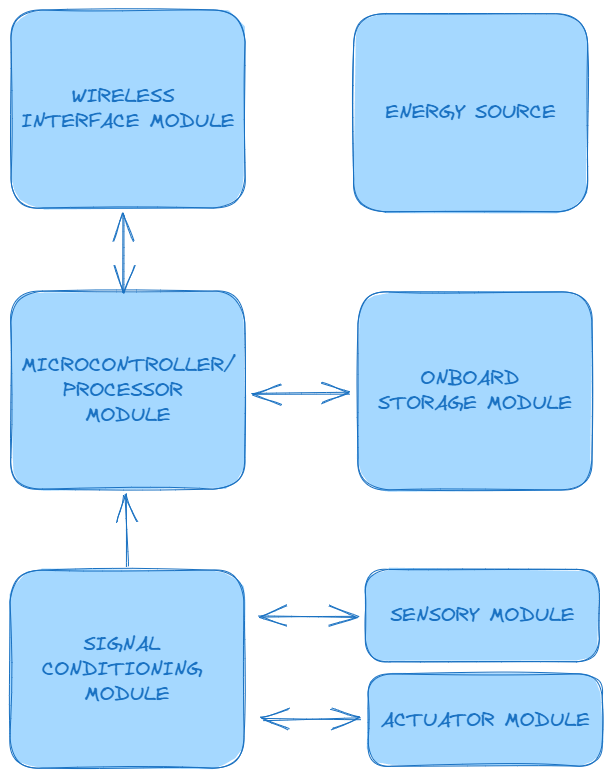
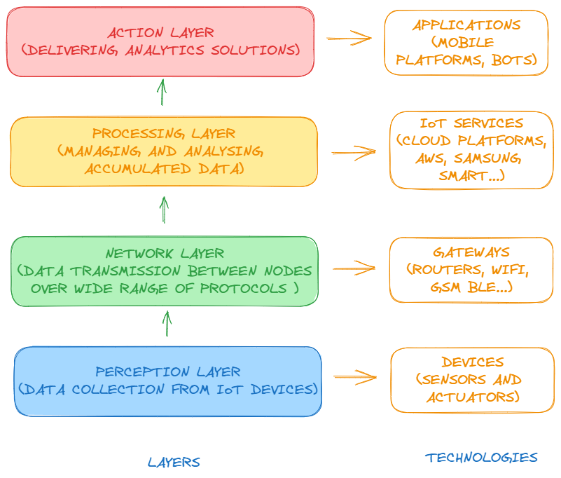
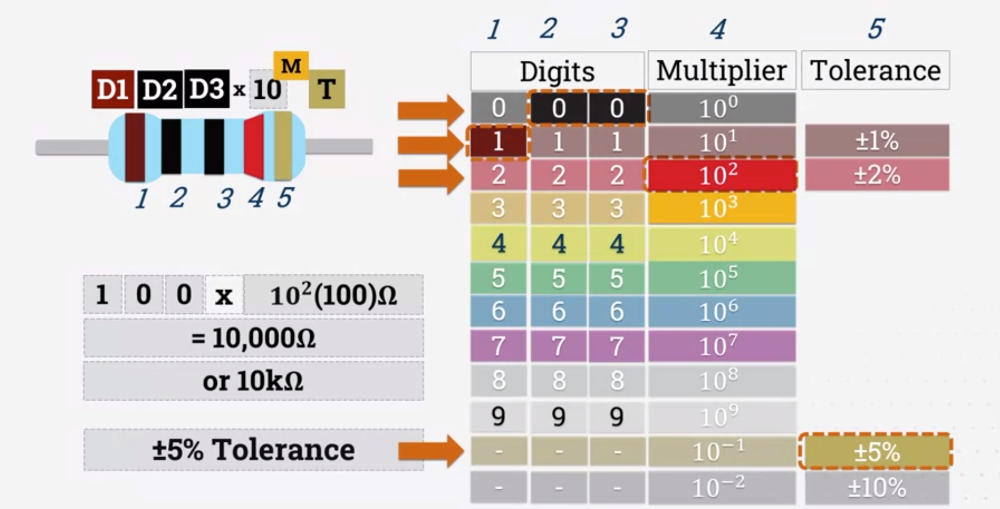
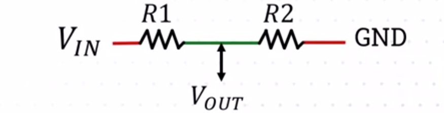
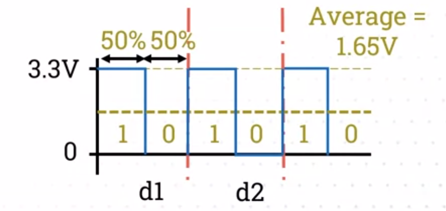
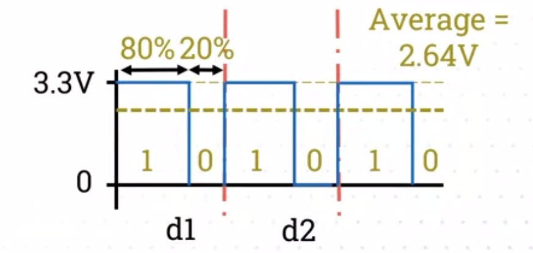
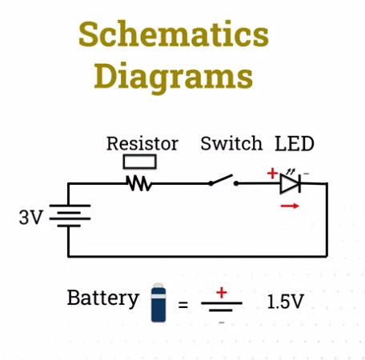
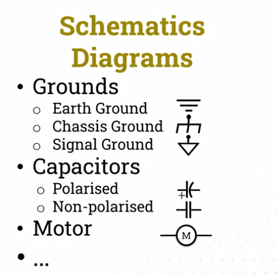
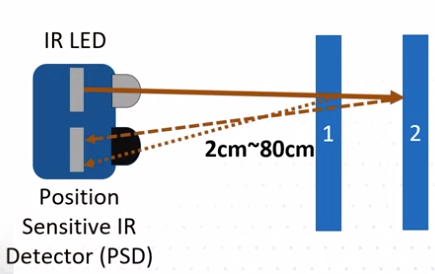
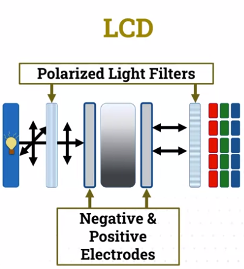

import Latex from '../../components/Latex.astro'

# Course learning objectives

1. demonstrate an understanding of electricity, electronics and transducers, including the relationship between analogue and digital devices
2. Program microcontrollers and understand the principles of microchip programming in general as well as how microcontrollers receive, interpret, and send data from/to transducers
3. Develop the practical skills of building circuits with electronic components and microchips
4. Use communication protocols for inter-computer and inter-device communication
5. Understand the principles of physical interaction design, including:
  - monitoring bodily movement
  - making mechanical movement
  - the design of tactile physical interfaces
  - control of sound and light
6. Design and build complete physical computing systems

# Topics
1. Microcontrollers
2. Electricity and circuits
3. Sensors
4. Physical Interaction Design
5. Physical Computing Projects
6. Motors and Actuators
7. Communication Protocols
8. Networked Devices
9. Bodily Monitoring
10. Robots

# Assessments
- Proposal (30%)
- Report and Project (70%)

### Week 1: Introduction to Physical Computing and IoT

##### What is Physical Computing? 
> _Physical computing involves the creation or use of physical hardware devices that can sense, reason and react to the world around them_

To put this in context, an environment in a given spatial location with many objects, such as humans and machines that interact with each other, can be sensed by a physical or a set of physical devices, reason with some limitation, and react to events around them

Good examples include self-driving cars, and smart homes

##### What is IoT?
> _IoT describes the network of physical objects - a.k.a "things" - that are embedded with sensors, software, and other technologies for the purpose of connecting and exchanging data with other devices and systems over the internet_  
> __Wikipedia__  

> _IoT is the concept of connecting any device to the internet and to other connected devices. The IoT is a giant network of connected things and people - all of which collect and share data about the way they are used and about the environment around them_  
> __IBM__

In essence, physical computing is an underpinning technology to drive the trending Internet-of-Things (IoT) applications

### Background to IoT, IoT stack and IoT architecture

Mark Weiser (Xerox Park) coined the phrase _Pervasive Computing_ in 1988 to mean:
> _A physical world that is richly and invisibly interwoven with sensors, actuators, displays and computer elements, embedded seamlessly in the everyday objects of our lives_

and _Ubiquitous Computing_ in 1991 to mean:
> _The most profound technologies disappear. They weave themselves into the fabric of everyday life until they are indistinguishable from it_

Also in 1991 he devised RFID tags. In 1999, Kevin Ashton evolved Mark Weiser's 'Networked System with Radio Frequency Identification Device (RFID)' to distributed systems where things or devices are in different geographical locations.  
The term was coined _Internet of Things_

##### Drivers of IoT

- efficient communications systems
- cheaper, smaller and powerful embedded computing devices
- cloud/fog computing

##### IoT boom

McKinsey Institute predicts the global IoT market to increase from $3.9 trillion to $11.1 trillion a year by 2025

##### Adaptation and nomenclature

examples of adaptation are:
- Consumer-IoT (cIoT)
- Industrial-IoT (iIoT)
- Internet-of-Medical-Things (IoMT)
- Internet-of-Vehicles (IoV)
- Smart Cities
- Smart Homes
- Smart Grid

IoT can be referred to as other names, such as:
- Web-of-Things (WoF)
- Network-of-Things (NoT)
- Machine-to-Machine (M2M)
- Internet-of-Everything (IoE) ...

##### IoT Building Blocks

There are seven key building blocks of IoT systems:

- Sensors Technology
- Embedded Electronics
- Energy Management
- Machine Intelligence
- Cyber Security
- Cloud Computing
- Data Analytics

What is the functional block of a typical IoT node? 

We know that an IoT node has sensory and actuator modules to gather information from the physical environment using digital or analog signals.  
The signals are passed to a signal conditioning module for data noise removal and amplification.  
This pre-processed signal is passed to a microcontroller or processor module to analyze, store and transmit to other devices using wireless interface modules.   
The energy source for the IoT node is important to manage as it may have limited battery capacity for wireless sensing.



##### IoT Ecosystem

Let us take a conceptual view of how a set of IoT nodes form an IoT ecosystem.  
In the first perception layer, we have a set of IoT devices that perform data collection using sensors, and take actions using actuators.  
The network layer transmits the data between the nodes over a wide range of protocols, with the help of gateway nodes.  
The processing layer analyzes and manages accumulated data using IoT platforms.  
The action layer delivers the analytic solution based on the findings from the processing layer using appropriate human-computer interface i.e. mobile device or smart speakers



##### IoT architectures & paradigms

As the sale of edge devices is predicted to grow, the consumptions of network traffic, energy used to transport data, and run big data centers for Cloud services will also increase greatly. As a result, the edge computing paradigm was created.  
This is where real-time data processing is done at the edge node. In this way, there will be low latency using IoT system and higher control on personal data for your users. However, depending on the requirements of the IoT systems, processing big data and storage may still need Cloud servers to complete the task.

##### IoT architecture evolution

Pre 2000s, most of the IoT systems were developed on a single mainframe machine. However, during 2000 - 2010 era of personal computers, a number of portable devices with embedded sensors were launched, which generated large numbers of data and required a distributed computing approach. Therefore, the _'service-oriented-architecture' (SOA)_ was introduced to utilize clusters of servers hosted in remote datacenters to store and compute information which portable devices could not do.  
In the last decade(s), _microservices architecture_, a subset of the SOA style has been introduced, where multiple servers are utilized for a single application due to an increase in demand for scalability, availability, and reliability.

### Week 2: Microcontrollers, circuit basics and assessment info

##### Intro to microcontrollers


Week 2 was basically setting up the programming environment, adruino IDE and nodeMCU esp8266 boards for programming

### Week 3: Introduction to electricity, analog and digital IO

###### Electricity

> The flow of electrons moving through a conductive material

###### Current

> The rate at which electrons flow through a circuit. Measured in Amperes, or Amps

###### Resistance

> The measure of a material's ability to restrict/oppose electrical flow. measured in Ohms (<Latex formula='\Omega' />)

Resistors are colour coded components introduced in the 1920's. Each colour corresponds to a number (digits, multiplier, tolerance etc)



###### Voltage

> The difference in charge between two different points

###### Ohm's law

<Latex formula='V=I \cdot R' centered={true} />

###### Capacitor

> Capacitors store small amounts of energy. There are 6 types:

- electrolytic
- ceramic disk
- tantalum
- mica
- paper
- film

<mark>Be Careful:</mark> Current can still flow from the capacitor once power has been removed

###### Transistor

> semiconductor device used to amplify or switch electrical signals

They are activated upon electric current instead of mechanical

###### Switches

There are two types of switches:
- binary (push button, reed switch etc.)
- non-binary (selector switch etc.)

###### Actuators

> Devices that use a form of power to convert a control signal into mechanical motion

Actuators require a controlled release of energy

#### Understanding digital and analog I/O signals

Analog signals are a continuous waveform of voltage between zero to the maximum voltage, i.e. 3.3V for the ESP microcontroller or 5V for any standard Arduino microcontroller.  
The voltage value needs to be converted to an analog value with respect to the bit rate of the microcontroller. This conversion takes time and introduces noise due to fluctuation of the voltage.  
On the contrary, the digital signal values typically are high (1) when the voltage is above 50 percent, or low (0) when it is below a 50 percent threshold.  
This process enables faster processing and has a low noise or error rate when reading the values

##### Voltage dividers

Microcontrollers have inbuilt voltage dividers to reduce input voltage to a lower output voltage. These dividers essentially use two resistors to lower the voltage as described in the figure below:



You can work out the output voltage, <Latex formula='V_{out}' /> with the following equation:

<Latex formula='V_{out} = V_{in} \cdot (\frac{R2}{R1+R2})' centered={true} />

For the ESP8266 voltage divider:
- it has 100k<Latex formula='\Omega' /> & 220k<Latex formula='\Omega' /> resistors
- maximum 3.2V in analog A0 input pin
- 10bit ADC (<Latex formula='2^{10} = ' />1024, <Latex formula='\therefore' /> 0 <Latex formula='\rarr' /> 1023 different values)

<Latex formula='3.2V_{in} \cdot (\frac{100k \Omega}{220k \Omega + 100k \Omega}) \cdot 1024' centered={true} />

##### Analog-to-Digital Converter (ADC)

stats to bear in mind:
- ESP8266: 0 -> 1023 (10 bit)
- ESP32: 0 -> 4095 (12 bit)
- ESP8266 takes approx. 135ms for ADC

functions of the arduino ADC:
- analogRead(pin)
- analogWrite(pin, 0-1023)
- digitalRead(pin)
- digitalWrite(pin, 0-1)

The values that we set for 10-bit resolution ESP8266 microcontroller between 0-1023 is known as pulse-width modulation (PWM)

##### Pulse-Width Modulation (PWM)

Pulse-width modulation is a method used for controlling voltage at each duty cycle.  
This is particularly useful when we want to control the output of a component, which is directionally proportion to the output that we provide.  
For example the brightness of an LED, or the speed of a motor, are directly proportional to the voltage provided to them.

See diagrams below, <Latex formula='d_1' /> and <Latex formula='d_2' /> are duty-cycles:

<div style={'display: flex; flex-direction: row; justify-content: space-around; align-items: center;'}>
  <div style={'margin-right: 0.1em;'}>
    
  </div>
  <div style={'margin-left: 0.1em;'}>
    
  </div>
</div>

LED brightness example:
```c
analogWrite(LED, 0); // 0%
analogWrite(LED, 102); // 10%
analogWrite(LED, 714); // 70%
analogWrite(LED, 1023); // 100% (lecture video shows value as 1024 but surely 1023?)
```

### Week 4: Practice with digital IO, circuit diagrams, and web servers

This week there was multiple labs for creating 'smart chair' and 'smart fridge' circuits

#### Introduction to creating and reading own circuit diagrams

So far we have looked at pin diagrams, with actual components to build our physical circuits. However, more technical drawings are called schematic drawings.  
Schematics diagram generally have dedicated legends, to allow us to interpret the complex connections of different components. See below some commonly used symbols:

<div style={'display: flex; flex-direction: row; justify-content: space-around; align-items: center;'}>
  <div style={'margin-right: 0.1em;'}>
    
  </div>
  <div style={'margin-left: 0.1em;'}>
    
  </div>
</div>

###### Batteries

A single battery is represented with longer and shorter lines, The longer line represents the positive current and the shorter line the negative current.

###### Resistors

Resistors are generally represented by waves, though the international standard is rectangles.

###### Diodes

The red arrow denotes the single direction current flow of the diode, and the two smaller arrows suggest that it emits light.

##### Circuit diagram software
- fritzing
- MS visio/word
- paint
- advanced:
  - AutoCad electrical
  - EPlan
  - Proteus Design Suite
- online editors:
  - circuito.io
  - circuit-diagram.org
  - tinkercad.com

##### From schematics to PCBs
- easyEDA
- online vendors:
  - JLC PCB
  - PCB Way
  - PCB Train
  - Euro Circuits


#### Understanding the different types of nodes

Nodes are any type of device that can sense, react or communicate. Within the Internet of Things world, these are devices that are interconnected or have network connectivity. These devices can be connected within the local area network (LAN), wireless local area network (WLAN), or wide area network (WAN).

###### Hub

- broadcasts messages to all devices connected to it
- messages are ignored if they are not addressed/connected
- only communicate in one direction (half-duplex)
- create unnecessary traffic
- security risks including data packets being intercepted

###### Bridge

- resolve device addressing problems
- reviews and records MAC addresses of connected devices
- fewer ports
- deprecated

###### Switches

- maintain an MAC address and port table
- can communicate in both directions simultaneously (full-duplex)
- improved security
- used extensively in data centres

###### Gateway nodes (edge nodes)

- less traffic control
- support different communication protocols i.e. zigbee, zwave, GSM etc.
- onboard programming
- IO

###### Router

- fulfil roles of both switches _and_ gateways
- connect to internet via ISP
- uses IP addresses and routing tables
- configurable
- better security e.g. secure tunnelling

###### Actuators

- react to the environment
- preform actions i.e.
  - sprinklers
  - automatic garage door
  - blinds etc.

#### Introduction to web server and displaying sensor states

see below code snippet from lab, for smart fridge application with web server integration:

```c
#include <ESP8266WiFi.h>
#include <ESP8266WebServer.h>

// Set the PORT for the web server
ESP8266WebServer server(80);

// The WiFi details 
const char* ssid = "enter_ssid";
const char* password =  "enter_password"; 

// Initialise the switch pin
// The variable to store the switch value
const int switch_pin = D1;
int switch_value;

// Initialise the potentiometer pin
// The value coming from the potentiometer
const int potentiometer_pin  = A0;
int poteValue;

// Initialise the minimum and maximum temperature of the fridge
int minTemp = -2;
int maxTemp = 6;

// Initialise the critical minimum and maximum temperature of the fridge
int criticalMinTemp = 2;
int criticalMaxTemp = 4;

// Initialise the buzzer pin
const int buzzer_pin = D5;

// Initialise the RGB pins
const int red_led_pin = D2;
const int green_led_pin = D3;
const int blue_led_pin = D4;

// put your setup code here, to run once:
void setup() {

  //Connect to the WiFi network
  WiFi.begin(ssid, password);  
  
  // Set the switch and potentiometer pins to INPUT
  // you want to read the state here
  pinMode(switch_pin, INPUT);
  pinMode(potentiometer_pin, INPUT);

  // Set the buzzer to OUTPUT
  // you want to set the state here
  pinMode(buzzer_pin, OUTPUT);
  // No sound initially
  digitalWrite(buzzer_pin, LOW);

   // LEDs as OUTPUT
  pinMode(red_led_pin, OUTPUT);
  pinMode(green_led_pin, OUTPUT);
  pinMode(blue_led_pin, OUTPUT);
  

  // Start the serial to debug the values
  Serial.begin(9600);

  // Wait for connection
  while (WiFi.status() != WL_CONNECTED) {  
      delay(500);
      Serial.println("Waiting to connect...");
  }

  //Print the board IP address
  Serial.print("IP address: ");
  Serial.println(WiFi.localIP());  

  server.on("/", get_index); // Get the index page on root route 
  server.on("/setBuzzerStatus", setBuzzerStatus); // Get the setBuzzer page
  
  server.begin(); //Start the server
  Serial.println("Server listening");

}

// put your main code here, to run repeatedly:
void loop() {

  // This will keep the server and serial monitor available 
  Serial.println("Server is running");

  //Handling of incoming client requests
  server.handleClient(); 

  // Only execute if the fridge is ON
  if (fridgeOn()){

    // Print the fridge temperature on the serial monitor
    Serial.println(fridgeTemperature());
    
    // Signal temperature status
    temperatureStatus(fridgeTemperature(), fridgeOn());
    
    // Signal critical temperatures
    // trigBuzzer();
    
  }else{
    // Signal temperature status (OFF)
    temperatureStatus(fridgeTemperature(),fridgeOn());
    // No sound, fridge is off
    noTone(buzzer_pin);
  }
}

// Utility function to check whether the fridge is ON
bool fridgeOn(){
  
  // read the switch pin value
  switch_value = digitalRead(switch_pin);
  //Serial.println(switch_value);
  
  // check the status and return either true or false
  if(switch_value == 0){
    return false;
  }
  return true;
  
}

// Utility function to set the fridge temperature
int fridgeTemperature(){
  
  // Read the value of the potentiometer (0--1023)
  poteValue = analogRead(potentiometer_pin); 

  // Map the potentiometer value in a range of minTemp - maxTemp
  poteValue = map(poteValue, 0, 1023, minTemp, maxTemp);

  return poteValue;
}


// Utility function to trigger the buzzer
void trigBuzzer(){
  
  // Check if your fridge temperature is acceptable
    if(fridgeTemperature() < criticalMinTemp || fridgeTemperature() > criticalMaxTemp){
       // Critical temperature, make a sound
       tone(buzzer_pin, 1000);
    }else{
       // Good temperature, no sound
       noTone(buzzer_pin);
    }
    
}


// Utility function to signal the temperature status
void temperatureStatus(int fridgeTemp, bool fridgeOn){
   
   // Turn off the RGB led (inverse mapping)
   if(!fridgeOn){
     analogWrite(red_led_pin, 255);
     analogWrite(green_led_pin, 255);
     analogWrite(blue_led_pin, 255);
     return;
   }

   // Turn on the red value of the RGB led (inverse mapping)
   if (fridgeTemp >= 0){
     int red_value = map(fridgeTemp,0,maxTemp,255,0); // mapping the red value 0 - maxTemp to 255 - 0
     analogWrite(red_led_pin,red_value );
     analogWrite(green_led_pin, 255);
     analogWrite(blue_led_pin, 255);
   }else{
     int blue_value =map(fridgeTemp,minTemp,0,0,255);  // mapping the blue value minTemp - 0 to 0 - 255
     analogWrite(red_led_pin, 255);
     analogWrite(green_led_pin, 255);
     analogWrite(blue_led_pin,blue_value );
   }
    
}


void get_index() {

  String html ="<!DOCTYPE html> <html> ";
  html += "<head><meta http-equiv=\"refresh\" content=\"2\"><meta name=\"viewport\" content=\"width=device-width, initial-scale=1.0\"></head>";
  html += "<body> <h1>The Smart Fridge Dashboard</h1>";
  html +="<p> Welcome to the smart fridge dashboard</p>";
  html += "<div> <p> <strong> The temperature preference is: ";
  html += fridgeTemperature();
  html +="</strong> degrees. </p>";
  html += "<p> <strong> Buzzer Component ";
  html +="</strong> </p> </div>";
  
  html += "<a href=\"/setBuzzerStatus?s=0\" target=\"_blank\"\"\"><button>Turn Off </button></a>";
  html += "<a href=\"/setBuzzerStatus?s=1\" target=\"_blank\"\"\"><button>Turn On </button></a>";
  
  html +="</body> </html>";
  
  //Print a welcoming message on the index page
  server.send(200, "text/html", html);
  
}

void setBuzzerStatus(){
  
  int query_string = 0;
  
  // Check the query string 
  if (server.arg("s") != ""){ //Parameter found
    // Parse the value from the query
    query_string = server.arg("s").toInt();
    // Check the value and update the blue led pin of the RGB component
    if(query_string==1){
     tone(buzzer_pin, 1000);
    }else{
     noTone(buzzer_pin);
    }
  }
}
```

### Week 5: Multimodal sensors and commercial IoT devices

#### Introduction to multimodal sensors and approaches

A smart environment is created using heterogeneous sensing devices. These devices can be generally categorized as vision or sensor based methods. Vision based sensing methods involve analyzing images sequentially to detect and track objects of interest. In the sensor based approach, sensors are either:
- distributed within the ambient environment 
- embedded into the objects (aka dense sensing)
- worn or implanted in/on our body

##### vision-based

Vision-based sensing methods involve processing camera images sequentially to detect and track objects. They have been extensively used in areas such as:
- facial expression recognition
- hand gesture detection
- body position and movement detection
- surveillance in indoor and outdoor environments 

The common steps for image processing involves pre-processing images, fragmenting those images, and performing algorithms for feature extractions and movement detection.

There are several image processing algorithms available, such as:
- Scale Invariant Feature Transformation (SIFT)
- Speed-Up Robust Feature (SURF)
- Features from Accelerated Segment Test (FAST)
- Histogram of Oriented Gradients (HOG)
- Histogram of Optical Flow Gaussian filter
- motion boundaries ...

The key point to take away from these different algorithms is that higher the accuracy that we need and more features that we want to detect, the longer the computation time will be

##### sensor-based

A sensor-based approach can be preferred to a vision-based approach, as there are fewer privacy and ethical issues to consider. 

###### Ambient sensors

Ambient sensing involves deploying sensors around the environment, usually on walls, doors, windows, large furniture etc. to detect events such as motion, sound, and climate e.g. temperature. The data collected from the ambient environment is usually used to perform time-series analysis to detect any anomalies in usual patterns.

###### Dense (embedded) sensors

Dense (embedded) sensing involves embedding sensors into everyday objects to capture the user's interactions with them. These everyday objects can be a perishable object, could be portable or fixed in one location. Examples include mugs, kettles, toasters, fridges etc.

A short list of dense sensor types than can be used for sensing can be seen below:
- capacitive touch
- tilt sensor
- accelerometer
- gyroscope
- force
- pressure
- liquid level (FDC1004)
- weight scale (load cell)
- temp/humidity (DHT11/12)
- RFID tags

##### Worn sensors

Wearable sensors can be split into two categories:

body-worn:
- watches
- glasses...

implants:
- rfid chips
- lenses
- diabetes and heart monitoring

##### Sensing vendors

off the shelf:
- pre-developed/tested
- proprietary or open source

proprietary:
- patented software/circuits
- pricing models

open source:
- flexibly integrate, extract and process data
- lower cost/ higher knowledge

#### Common physical sensors - ambient and dense

##### Temperature sensors

Temperature sensor types:
- thermocouples
- thermistors (limited range)
- resistor temperature detector (RTD)
- Infrared temperature sensors (non-contacting)
- thermometers

These temperature sensors have varied reading ranges and accuracy levels. They can be contact-based or non-contact-based sensors.

##### Distance sensors

###### IR distance

The infrared proximity sensor has an infrared LED and position-sensitive infrared detector (PSD).  
The infrared LED emits the light beam and the PSD captures the reflected light returned from an object and the distance triangulated taking in to account time taken and angle. The range is approximately 10-80cm.
<div style={'display: flex; flex-direction: row; justify-content: center; align-items: center;'}>
  <div>
    
  </div>
</div>

###### Ultrasonic HC-SR04

An ultrasonic sensor triggers a sound wave, and receives the sound echoed from the surface of the object. The duration between the triggering and receiving the echo is calculated:

<Latex formula="distance = \frac{(duration \times speed \space of \space  sound)}{2}" centered={true} />

The range is approximately 2-400cm

###### Light based Detection And Range (LiDAR)

These types of sensors use triangulation and pulse methods to obtain a highly accurate distance reading of an environment and even create point clouds for detailed modeling.  
LiDAR sensors are generally more expensive than the other distance sensors and can be harmful to human eyes.

##### Inertial Measurement Units (IMUs)

A typical IMU consists of an:
- accelerometer
- gyroscope
- magnetometer

These measure the linear acceleration, angular velocity, and magnetic field strength to orient w.r.t the Earth's axis, respectively.  
IMUs with six Degrees of Freedom (6 DoF) contain only the accelerometer and gyroscope, with three axis each. nine Degrees of Freedom (9 DoF) IMUs can be achieved by adding the magnetometer.

IMUs by themselves are prone to errors, or drifts in the measurements over time. Therefore, the sensor data is usually calibrated, filtered, and combined using algorithms such as a Kalman Filter. Alternatively, average readings of multiple IMUs sensors are used to improve the accuracy of the measurements.

### Week 6: Data visualisation and CW1 requirements

#### Introduction to displays (LCD, OLED, TFT) for sensor data

##### Dot matrix
- you control each LED
- typical size is 64 LED (8x8)
- you can merge multiple dot matrices

##### LCD
- Liquid Crystal Display (LCD)
- typical size is 16 characters per line x 2
- backlit to illuminate
- colour filters

The LCD consists of a back light, liquid crystals in the middle, and RGB colour filtration films at the front. As the light is emitted in all directions, horizontal or vertical polarized light filters are used to change their direction.

<div style={'display: flex; flex-direction: row; justify-content: center; align-items: center;'}>
  <div>
    
  </div>
</div>

##### OLED
- Organic Light Emitting Diode (OLED)
- typical size is 0.96 inch or 1.3 inch
- pixels are controlled individually
- accurate colours
- higher power efficiency, smaller sizes, and more accurate colour displays than LCDs, though can be more costly

##### TFT
- Thin Film Transfer (TFT)
- Uses transistors for each pixel
- Non/Touch versions
- varying resolution

__N.B.: Go through the lecture video and lab on smart fridge part 5, and the same for smart door parts 1 and 2__


#### Coursework 1 requirements

key points:
- 30% weighting
- 1500 word limit
- deadline: midterm
- key requirements:
  - investigate and review IoT projects
  - identify problems, challenges, and propose own IoT project to develop by end of course
  - create a design plan
  - create an evaluation plan

selecting a project:
- review the list of topics
- pick topic of most interest
- identify problems and create an initial hypothesis
- perform initial review by surveying papers, books and websites etc.
- develop aims and objectives from the initial research (refine later)
- start planning

requirements:
1. MAX 3 ESP-based microcontroller nodes
2. MIN 3 sensors and/or actuators should be used per node
3. developed using Arduino IDE only
4. all nodes should be directly/indirectly linked
5. all nodes have a:
  - dashboard
  - respond to REST-based HTTP requests in a JSON format
6. external libraries for Arduino IDE and third-party commercial devices such as smart speakers e.g. alexa or google home, and one raspberry pi can be used, but are not mandatory
7. Project-specific sensors and actuators outside the prerequisite kits can be used, but limited to a total of 3 ONLY

example report structure:

- abstract
- introduction
- methodology
- literature review
- project proposal
- system design
- test plan
- implementation progress
- summary/conclusion
- references/appendices

more details can be found in assessment 1 brief released when midterm starts

### Week 7: 

#### Human interaction with IoT devices

Human interaction with IoT devices occurs in the __action layer__ of the IoT ecosystem diagram mentioned earlier in the course. 

NLI = natural language interface  
NLP = natural language programming  

##### NLI

The natural language interface in essence uses speech recognition technology to convert speech to text in a given language. This textual data generated is unstructured, so is analyzed by splitting it into small chunks to understand the meaning behind individual key words and sentences.  
These kinds of natural language interfaces are extensively used for applications such as text translation, search engines, and home control and automation. For example, you can use smart speakers such as google home or amazon Alexa in a given room to turn on or off bedroom lamp. These smart speakers interact with their respective online platforms to convert the speech to text using a Natural Language Processing engine for reasoning and reacting to the request. In this case, redirecting requests to its own system or other 3rd party platform.  
A smart wall socket, which controls the electricity to a lamp is connected to a local wi-fi router. The smart speaker connected to the same router can automatically discover available devices with unique names. This device name is then use for smart speaker to trigger the command to the smart wall socket here instead of the smart wall socket. We can also have our own microcontroller trigger, read, or write commands with these smart speakers.

##### NLP

NLP is a discipline that processes unstructured linguistic information from a multidisciplinary perspective. For example, computer scientists may be interested in theoretical and practical implementation of techniques, whereas information scientists may be concerned with how the texts are analyzed, classified, manipulated, retrieved and disseminated to other people. Likewise, cognitive science researchers coming from psychological or social science backgrounds may well be interested in computational reasoning for finding meaning behind the human information, perception, and the language styles.  
NLP combines artificial intelligence and computational linguistics to allow computers to allow computers to seamlessly understand and interact with humans. Typical tasks performed with NLP are to recognize:

- entities
- key phrases
- detect language
- sentiment
- syntax checking 

from a given sentence in general. There are two types of natural language processing paradigms, symbolic and statistical.  
The symbolic paradigm is a rule-based approach to define the meaning of something when one or more conditions are true. These rules are generally hand coded by the linguistic and subject experts.  
The statistical approach is heavily reliant on the previous data, patterns, and frequencies learned from machine learning approaches that are human supervised or unsurprised methods. Moreover, when analyzing and reasoning with the linguistic terms, syntax and semantic based analysis is performed to accurately understand implicit or explicit context and meaning behind the sentence. Syntax and semantics analysis can be easily confused. Here, the syntax of a given sentence in a particular language is analyzed using grammar rules and vocabulary to interpret a single meaning, whereas the semantic analysis is concerned about the meaning of a statement which can be written in a multiple syntactical statement to mean the same thing. Libraries that can be used are:

- NLTK
- Google natural language AI
- Amazon comprehend

