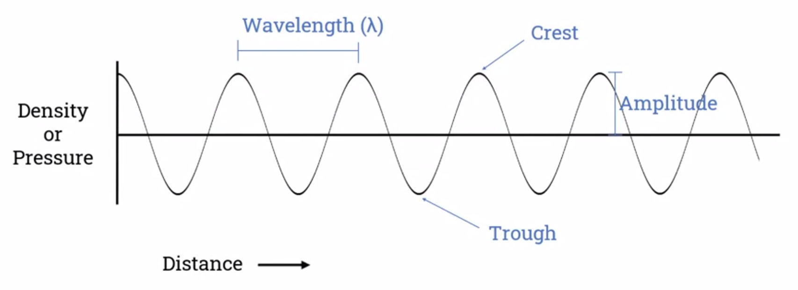
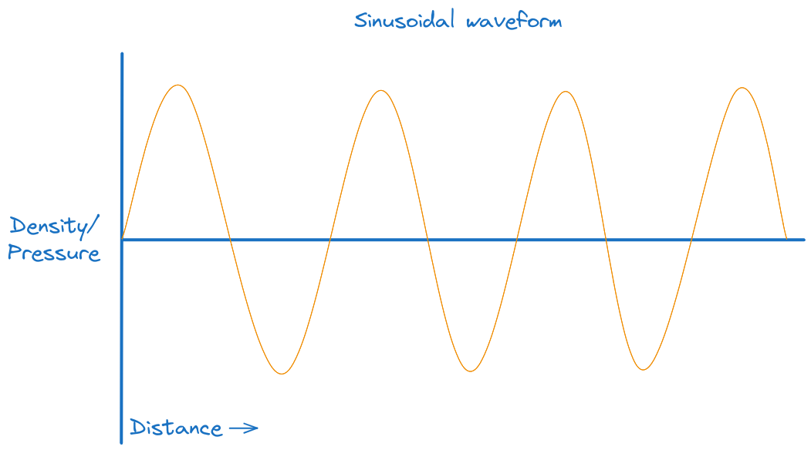
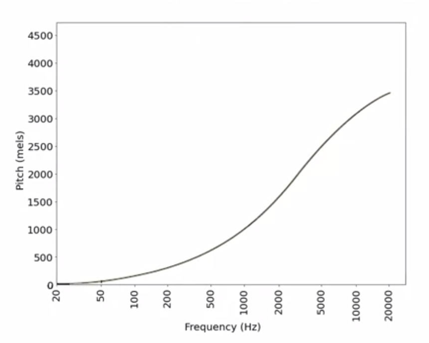
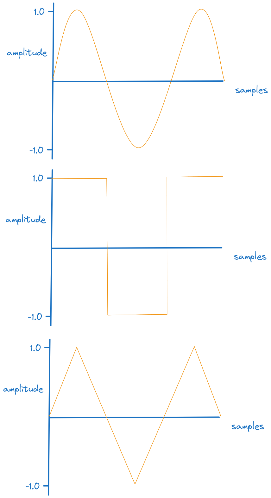
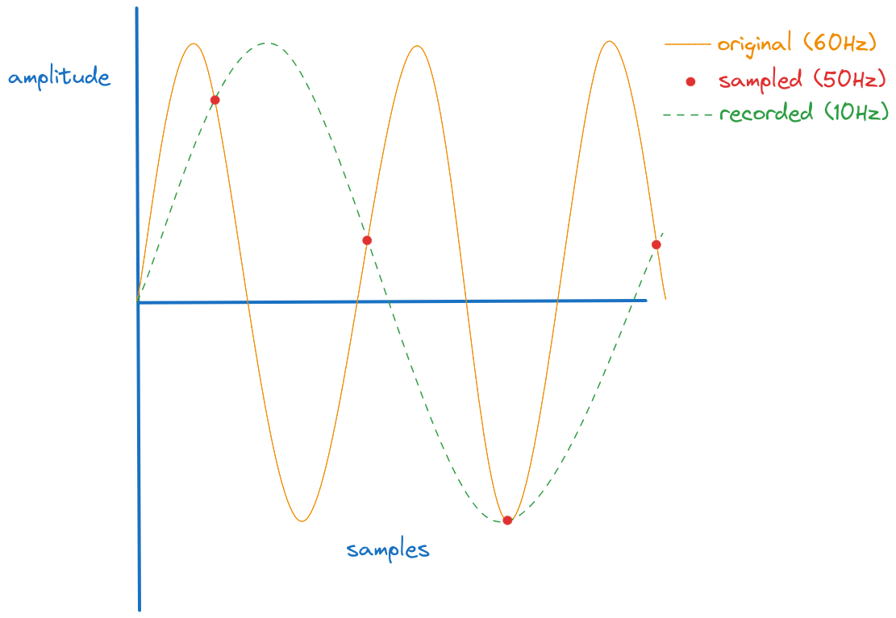
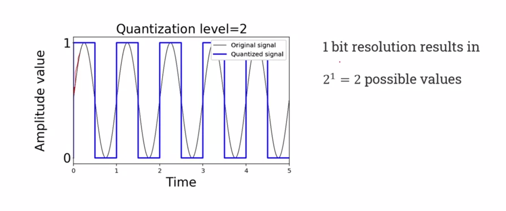
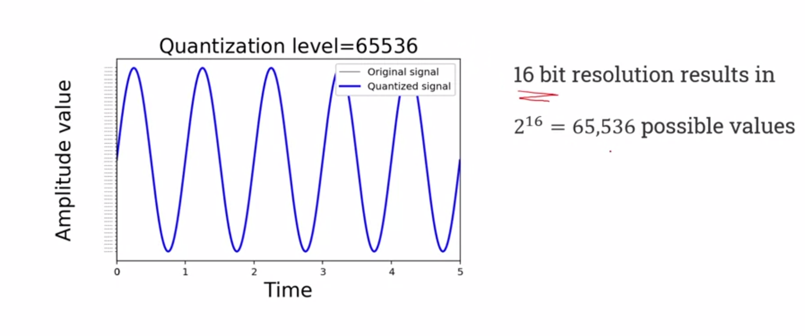
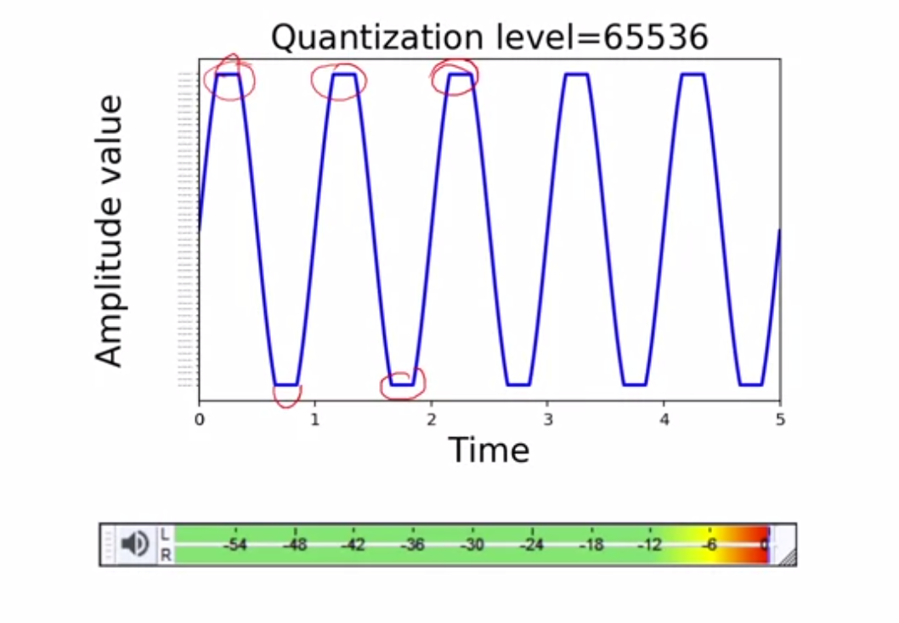
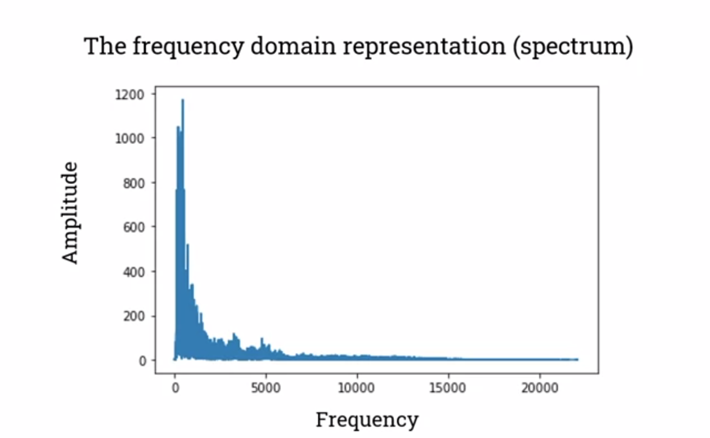
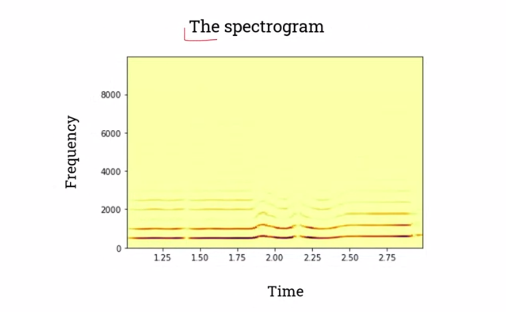

import Latex from '../../components/Latex.astro'

# Overview

The course's aims are to teach the basic principles and tools used in intelligent signal processing systems and what _is_ an intelligent signal processing system.  
Intelligent signal processing involves capturing, storing and playing, processing, and extracting information from various signals found in the world using a computer system.
The course will cover how audio and video signals can be captured and processed by a computer program. How you can also extract information from audio and video signals and use this knowledge to implement intelligent signal processing systems, such as speech recognition system or movement and face detection systems.

# Module goals and objectives

Upon successful completion of this module, you will be able to:

1. Explain how audio and video signals can be represented digitally and what the key properties of these signals are.
2. Write computer programs that can capture, process and play back audio and video signals.
3. Understand and use discrete Fourier transforms to process audio signals in the frequency domain and explain the process of feature extraction.
4. Implement simple movement and face detection systems that work with live camera input.
5. Describe the key components of a speech recognition system and analyse the design decisions involved.
6. Select and describe appropriate techniques for compressing audio and video signals

# Topics

1. Digitising, representing and storing audio signals

> Key concepts:
> - Audio fundamentals
> - Digitising audio signals
> - Audio editors: Introduction to Audacity
> - Audio programming with p5.js
> - Introduction to audio programming with Python

2. Editing and processing digital audio

> Key concepts:
> - Digital audio editing
> - Processing digital audio
> - Advanced audio processing

3. Frequency domain representations

> Key concepts:
> - Sound analysis
> - Convolution and the frequency domain

4. Extracting features from audio signals

> Key concepts:
> - Audio signal feature extraction
> - Real-time audio visualizations with Javascript
> - Audio signal feature extraction with Python

5. Speech recognition

> Key concepts:
> - Introduction to speech recognition
> - Speech recognition in p5.js
> - Speech recognition in Python

6. Capturing, representing and processing camera input

> Key concepts:
> - Introduction to digital video
> - Capturing and processing digital video
> - Capturing and processing video with p5.js

7. Computer vision: movement detection

> Key concepts:
> - Introduction to Computer vision
> - Computer vision: movement detection
> - Movement detection with p5.js

8.  Computer vision: face detection

> Key concepts:
> - Computer vision: face detection
> - Face detection with p5.js

9. Audio file formats. Compressing audio signals

> Key concepts:
> - Audio file formats
> - Compressing audio signals
> - Compressing audio signals: software. Compressing audio with python

10. Video file formats. Compressing video signals

> Key concepts:
> - Video file formats
> - Compressing video signals
> - Record, convert and stream audio and video with ffmpeg
> - p5.js and python applications with ffmpeg

# Assessments
- Midterm coursework (multiple submissions throughout the year) (50%)
- Final coursework (multiple submissions throughout the year) (50%)

## Digitising, representing and storing audio signals - part 1

### what is sound?

How is it generated?  
How does it travel?  
How is it perceived?

_In terms of physics:_  
Sound is a form of energy produced by vibrating matter, for example, a bell. Sound is mechanical energy that needs a medium to propagate.  
In contrast to electromagnetic energy, sound cannot travel in vacuum. Sound can travel through solids, liquids, and gases. It travels in the form of mechanical waves, which can move in all directions.

_In terms of physiology and psychology:_  
Sound is the reception of these sound waves and their perception by the brain.  
Sound waves arrive through the ears. Our receptor, a human for example, then converts these waves into sound. The human ear is a complex bio-mechanical system. Sound waves travel up to the ear canal, and force the eardrum to vibrate, then a complicated mechanism converts the vibration to nerve impulses, which are interpreted by the brain of a person or animal, as sound.

### Characteristics of sound waves

- velocity
- wavelength
- frequency
- time period
- amplitude

##### velocity

The speed of sound depends on the elasticity, density, and temperature of the medium the sound is traveling through. e.g. at 0&#176;C, the speed of sound in air is about 331m/s.  
Here, the temperature is important. The density of the material changes with temperature, the greater the density of a material, the higher the speed of sound. For example, at 20&#176;C, the air is more dense than at 0&#176;C and the sound travels faster through it. In particular, the speed of sound in air 20&#176;C is about 343 m/s.

##### wavelength

If we closely observe what happens to the air molecules when we play a bell, we will see that the vibration of the bell produces areas in which the particles are closer together and areas in which they are further apart. In other words, the vibration of the bell creates in the surrounding area a series of alternating high pressured regions called compressions and low pressure regions called rarefactions that travel away from the bell at a certain speed.  
It's interesting to note that the air molecules vibrate back and forth, but they _<u>do not travel with the wave</u>_. Sound waves _transfer energy but not matter_. The wave _energy_ travels in this direction, <mark>not the matter</mark>.  
Sound waves can be represented as a function, which ranges over particle density or pressure values, across the domain of distance.

This way of representing sound waves helps to introduce some fundamental characteristics of sound:

> __Wavelength__  
> The wavelength can be defined as the distance between two successive crests or troughs of a wave

> __Amplitude__  
> the amplitude is the maximum change in pressure or density that the vibrating object produces in the surrounding air  

Pressure is measured in pascals. Although for practical reasons for measuring sound amplitude, we usually use a logarithm ratio scale, the dB SPL scale.

> __Frequency__  
> The frequency of a wave refers to the number of compressions or rarefactions that pass a given point per unit of time

Frequency is measured in hertz (Hz)

> __Time Period__  
> The time period is the time a sound wave takes to go through a compression-rarefaction cycle

##### relationships

The period (<Latex formula='T'/>) is the inverse of frequency (<Latex formula='f'/>)

<Latex formula='T=\frac{1}{f}, f=\frac{1}{T}' centered={true} />

There is also a direct relationship between sound speed (<Latex formula='v'/>), wavelength (<Latex formula='\lambda'/>) and frequency (<Latex formula='f'/>):

<Latex formula='v=f\lambda' centered={true} />

### Human sound perception

The table below summarizes the physical properties of sound waves: frequency, amplitude, waveform, wavelength, time period, and duration.  
Also the three-dimensions of our psychological sensation of sound: pitch, loudness, and timbre

|Physical properties|Perceptual properties|
|:---:|:---:|
|Frequency|Pitch|
|Amplitude|Loudness|
|Waveform|Timbre|
|Wavelength|
|Time Period|
|Duration|

Pitch is the quality that makes it possible to classify sounds as higher and lower.  
Loudness is the quality that makes it possible to order sounds on a scale from quiet to loud.  
Timbre, also known as tone color or tone quality, describes those characteristic of sound which allow the ear to distinguish sounds which have the same pitch and loudness.

Simplifying, we could say that:
- the frequency of sound waves is related to the perception of pitch
- the amplitude of sound waves is related to their perception of loudness
- the waveform is related to their perceptual of timbre

But this is not so simple. Firstly, the relationship between the physical properties of a sound wave and the way we perceive it is _non-linear_. e.g. a change in frequency does not always correspond with that constant change in pitch.  
Secondly, the way all these properties are related to each other is not so simple. For example, yes, we can say that frequency is related to pitch, but the frequency also affects the loudness and timbre, the amplitude affects the pitch, the waveform affects to the pitch, the duration affects to the pitch and the timbre. In fact, all these properties are related to each other.

##### Pure Tone

A pure tone is a sound that can be represented by a sinusoidal waveform

It's important to note that real-world sounds are not pure tones. Pure tones can only be produced technologically. When we play for example, a piano note, we generate that sound with a _fundamental frequency_, but at the same time, we also generate an _infinite number of overtones_. Real-world sounds are complex, composed of many frequencies and a pure tone is a _sound with a single frequency_.

##### Perception of pitch

As has been mentioned previously, frequency is perceived by humans as pitch i.e. a high frequency sound wave corresponds to a high pitch sound, and a low frequency sound wave corresponds to a low pitch sound.

As we can see in the above figure, the relationship between pitch and frequency is not a simple linear one. e.g. for frequencies above one kilohertz, a greater change in frequency is needed to produce a corresponding change in pitch

Humans cannot hear all the sound waves that arrive to their ears. For normal hearing the limit of human hearing for frequency falls between 20Hz and 20,000Hz.  
Frequencies above 20,000Hz are known as ultrasounds. Frequencies below 20Hz are known as infrasound.

##### Perception of loudness

The perception of loudness is related to the amplitude of sound waves

| Source|Sound Pressure(uPa)|
| :---: | :---: |
| hearing threshold| 20uPa |
| quiet bedroom at night| 630uPa |
| conversational speech (1m away) | 20,000uPa |
| vacuum cleaner (1m away) |  63,000uPa |
| city road (5m away) | 200,000uPa (0.2Pa) |
| threshold of discomfort | 20,000,000uPa (20Pa) |
| threshold of pain | 63,200,000uPa |
| jet aircraft (1m away) | 632,000,000uPa |

As can be seen, the human ear can perceive a wide range of sound pressure. To express sound amplitude in terms of pascals is inconvenient because we have to deal with numbers from as small as 20 to as big as 20 million.  
For practical reasons, we usually use a logarithmic scale for measuring sound amplitude. The scale that we use is called the __dB SPL scale__.  
The formula that allows us to express sound pressure in terms of dB SPL is:

<Latex formula='SPL=20 \log _{10} (\frac{P}{P_{ref}})' centered={true} />

> here <Latex formula='P' /> is the sound pressure we are measuring, and <Latex formula='P_{ref}' /> is our reference, the pressure of the smallest sound we can hear, <Latex formula='2.0 \times 10^{-5}' /> Pa

The logarithmic scale is useful as it enables the huge range of human hearing from the quiet sound to hearing discomfort to be expressed on a scale of 0-120 dB SPL. 

Another useful aspect of using a decibel scale for expressing sound amplitude is that it gives a much better approximation to the human perception of relative loudness than the pascal scale. The relation between the subjective quality of loudness and the physical quantity of sound pressure level is quite complex, but a couple of important things to note are:

- the ear is more sensitive to high-mid frequencies that to bass frequencies
- the human ear interprets changes in loudness within a logarithmic scale

##### Perception of timbre

Timbre or tone quality is what differentiates two sounds of the _same frequency and amplitude_.  
The perceptual property of timbre is related to the _physical property_ or the <mark>shape of the wave</mark> or the wave form. Timbre is also related to the physical property of the sound's __spectrum__, but this will be covered in a later lecture.

### The digital world: sample rate and bit depth

##### Capturing and digitising sound waves

We've seen that sound waves can be represented as a function across the domain of time. If we have a sound wave, we can measure with a sound level meter, the air pressure changes in a single point in the air through time.  
In actual fact, the sound level meter uses a microphone to convert air pressure changes into an electrical signal measured in Volts, and this is the first step to capture and digitize a sound wave. The microphone converts air pressure changes into an electrical signal.  
The electrical energy generated by a microphone is usually quite small, so we need a device called __preamplifier__ to convert the weak electrical signal generated by the microphone into an output signal strong enough to be digitized.  
Then the analog-to-digital converter (ADC) measure the incoming voltage a number of times per second and assigns a numerical value to it. We can then use these values in our computer, phone, digital recorder etc.

##### Playing audio

In the opposite case, i.e. we want to play digital audio, we have to use a digital-to-analog converter (DAC). The digital-to-analog converter converts the digital signal back into an analog electrical signal. Then again, we have to use an amplifier to amplify the level of the signal and send it to a speaker or headphones that will generate the sound wave.

##### Sampling rate

The ADC measures the voltage some number of times per second. This number is called the sampling rate, and each measurement of the waveform's amplitude is called a sample. The faster we sample, the better the quality. The sampling rate of a CD is 44.1 kKz, and DVD is 48 kHz. Professional audio can be 88-96 kHz. The __more samples we take, the more memory size we need__

##### The Nyquist-Shannon sampling rate

Nyquist frequency = <Latex formula='\frac{1}{2} \times' />sampling rate

Signals above the Nyquist frequency are not recorded properly by ADCs, introducing artificial frequencies in a process called __aliasing__.  
The sampling rate must be a least twice the frequency of the signal being sampled.

The example below illustrates a 60Hz original track sampled at 50Hz (red dots). <mark>The resultant recording is a 10Hz signal!</mark>

If we want to capture 60 hertz signal, the sampling rate has to be at least 120Hz. This way, we will take enough samples to capture the original signal.

To mitigate the aliasing problem mentioned above, devices add in an 'anti-aliasing filter' before the ADC. This is a low-pass filter that eliminates frequencies above the Nyquist frequency before audio reaches the ADC.

##### Bit depth

> __Sampling Rate__  
> The number of samples taken per second

> __Bit Depth (a.k.a Sample Width, Quantisation level)__  
> The number of bits used to record the amplitude measurements

The more bits used, the more accurately an analogue waveform can be measured, however this means more memory used. Common bit widths used for digital sound representation include: 8, 16, 32 & 64 bits.

A bit depth of 16 is the mimimum that should be used really for a good audio recording, though 24 or 32 bits can also be used.

##### Clipping

Clipping occurs when the level of the input signal is too high and the ADC cannot assign to the signal the correct measurements. The ADC assigns maximum or minimum amplitude values to many samples in a row. This results in a waveform with a flat top and bottom that generates digital distortion.

To avoid this, e.g. whilst using our audacity or another software, the level meters need to be observed to make sure that the input level doesn't reach zero. If the level meter reaches zero, this means that the signal is clipping

> __Practice Question__  
> What is approximately the size of an uncompressed stereo audio file, the sound time of which is one minute at a sampling frequency of 44.1 kHz and a resolution of 16 bits?

freq = 44,100Hz  
bit depth = 16  
length = 60s  
channels = 2 (stereo)

size = <Latex formula='\frac{44,100 \times 60 \times 2 \times 16}{8}=10,584,000 \approx' />10Mb

### Digital audio representation: the time domain

There are two ways of representing digital audio:
- time domain
- frequency domain

The time-domain representation gives the amplitude of the signal at the instance of time at which it was sampled. Plotting these values creates the signal waveform. That's why this way of representing digital audio is also called waveform view.  
For a time-domain representation, time can be expressed in decimal format, samples, frames-per-second etc.  
Amplitude values can be expressed in normalised values (1.0 -> -1.0), decibels (dBFS), sample values (0-65,535) etc.

<mark>__Note__</mark> dBSPL <Latex formula='\neq' /> dBFS

> SPL = Sound Pressure Level

> FS = Full Scale

##### normalised to dBFS

<Latex formula='dBFS=20 \log _{10}(abs(norm\_val) )' centered={true} />

e.g. normalised value = 0 <Latex formula='\rarr dBFS=20 \log _{10}(abs(0) ) = - \infty' />  
e.g. normalised value = 1 <Latex formula='\rarr dBFS=20 \log _{10}(abs(1) ) = 0' />  
e.g. normalised value = -1 <Latex formula='\rarr dBFS=20 \log _{10}(abs(-1) ) = 0' />  

##### Brief intro to frequency domain

There is another way that show the __energy__ of a sound. As eluded to earlier, sounds are complex, they don't just have one frequency. Sound can be composed of millions of frequencies. The frequency domain gives us information about the frequencies of a sound.

##### Spectrogram

A spectrogram is very similar to the frequency domain representation, but here it also visualises how the spectrum changes through time

