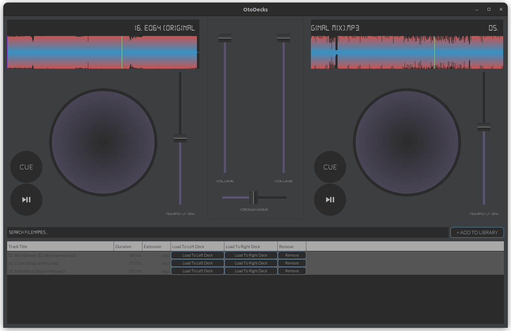

OtoDecks is a DJ application designed for the playback and mixing of multiple audio tracks as a disk jockey would with physical DJ decks. The software is written in C++, and utilises the JUCE audio and GUI programming framework.

# Features

### Realistic DJ Decks
- UI of the DJ decks akin to industry standard DJ hardware
- jogwheel implemented to alter the tempo of the track on the fly
- tempo slider to alter track tempo to aid in mixing
- cue, play and pause buttons
- cue points can be set on the track by zooming into the track waveform display and setting
- scrolling track info display

### Mixer
- two channel mixer implemented
- individual volume sliders
- crossfader slider

### Music Library
- stage tracks from local storage into the music library
- track metadata displayed on screen
- library search/filter/sort capabilities
- load tracks onto decks from the library
- library state is saved to xml file so music library is persistent

### Custom Theme
- overrides the Juce LookAndFeel_V4 class to create a custom theme